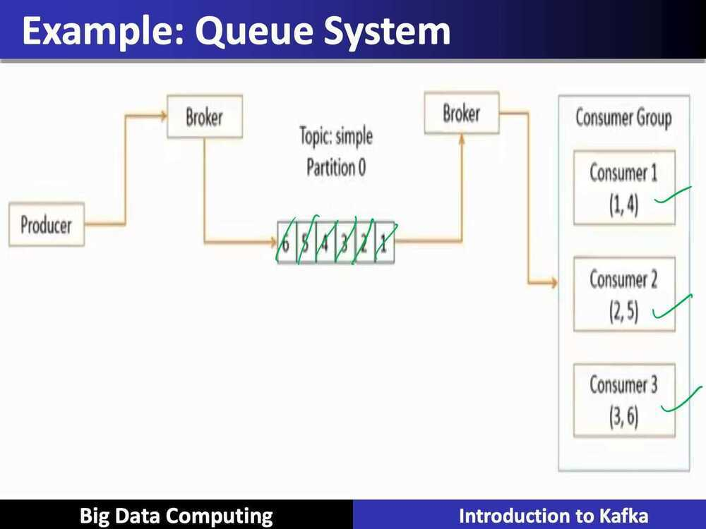
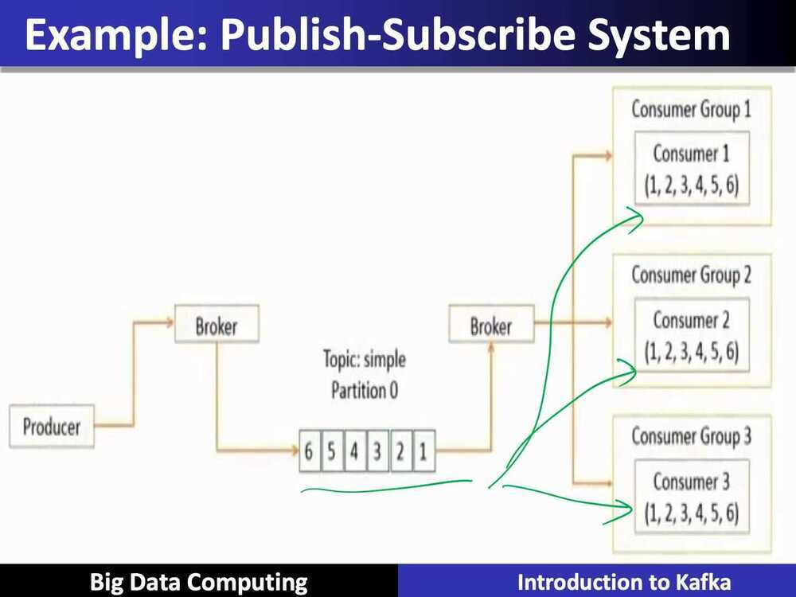

# Intro to Kafka

## Kafka: a streaming data platform, Unix Pipelines Analogy

- Kafka Core is the distributed, durable equivalent of Unix pipes. Use it to connect and compose your large-scale data applications
- Kafka Streams are the commands of your Unix pipelines. Use it to transform data stored in Kafka
- Kafka Connect is the I/O redirection in your Unix pipelines. Use it to get your data into an out of Kafka.

## Characteristics

- It is a distributed and partitioned messaging system
- It is highly fault-tolerant
- It is highly scalable
- It can process and send millions of messages per second to several receivers

## History

- Originally developed by LinkedIn and later, handed over to the open source community in early 2011
- It became a main Apache project in October, 2012
- A stable Apache Kafka version 0.8.2.0 was release in Feb, 2015.

## Kafka Data Model

The Kafka data model consists of messages and topics

- Messages represent information such as, lines in a log file, a row of stock market data, or an error message from a system
- Messages are grouped into categories called topics. Example: LogMessage and Stock Message
- The processes that publish messages into a topic in Kafka are known as producers.
- The processes that receive the messages from a topic in Kafka are known as consumers.
- The processes or servers within Kafka that process the messages are known as brokers.
- A Kafka cluster consists of a set of brokers that process the messages

## Topics

- A topic is a category of messages in Kafka
- The producers publish the messages into topics
- The consumers read the messages from topics
- A topic is divided into one or more partitions
- A partition is also known as a commit log
- Each partition contains an ordered set of messages
- Each message is identified by its offset in the partition
- Messages are added at one end of the partition and consumed at the other

## Partitions

- Topics are divided into partitions, which are the unit of parallelism in Kafka
    - Partitions allow messages in a topic to be distributed to multiple servers
    - A topic can have any number of partitions
    - Each partition should fit in a single Kafka server
    - The number of partitions decide the parallelism of the topic

## Partiton distribution

- Partitions can be distributed across the Kafka cluster
- Each Kafka server may handle one or more partitions
- A partition can be replicated across serveral servers for fault-tolerance
- One server is marked as a leader for the partition and the others are marked as followers
- The leader controls the read and write for the partition, whereas the followers replicate the data
- If a leader fails, one of the followers automatically become the leader.
- Zookeeper is used for the leader selection

## Producers

The producer is the creator of the message in Kafka

- The producers place the message to a particular topic
- The producers also decide which partition to place the message into
- Topics should already exist before a message is placed by the producer
- Messages are added at one end of the partition

## Consumers

The consumer is the receiver of the message in Kafka

- Each consumer belongs to a consumer group
- A consumer group may have one or more consumers
- The consumers specify what topics they want to listen to
- A message is sent to all the consumers in a consumer group
- The consumer groups are used to control the messaging system

## Kafka Architecture

Kafka consists of brokers that take messages from the producers and add to a partition of a topic. Brokers provide the messages to the consumers from the partitions.

- A topic is divided into multiple partitions
- The messages are added to the partitions at one end and consumed in the same order
- Each partition acts as a message queue
- Consumers are divided into consumer groups

## Types of messaging systems

- Kafka architecture supports the publish-subscribe and queue system
- Publish-subscribe system
    - Each message is received by all the subscribers
    - Each subscriber receives all the messages
    - Messages are received in the same order that they are produced
- Queue system
    - Each message has to be consumed by only one consumer
    - Each message is consumed by any one of the available consumers
    - Messages are consumed in the same order that they are received

## Brokers

Brokers are the Kafka processes that process the messages in Kafka

- Each machine in the cluster can run one broker
- They coordinate among each other using Zookeeper
- One broker acts as a leader for a partition and handles the delivery and persistence, where as, the others act as followers

## Kafka Guarantees

- Messages sent by a producer to a topic and a partition are appended in the same order
- A consumer instance gets the messages in the same order as they are produced
- A topic with replication factor N, tolerates upto N-1 server failures

## Replication in Kafka

Kafka uses the primary-backup method of replication

- One machine (one replica) is called a leader and is chosen as the primary; the remaining machines (replicas) are chosen as the followers and act as backups
- The leader propagates the writes to the followers
- The leader waits until the writes are completed on all the replicas
- If a replica is down, it is skipped for the write until it comes back
- If the leader fails, one of the followers will be chosen as the new leader; this mechanism can tolerate n-1 failures if the replication factor is n

## Persistence in Kafka

Kafka uses the Linux file system for persistence of messages

- Persistence ensures no messages are lost
- Kafka relies on the file system page cache for fast reads and writes
- All the data is immediately written to a file in file system
- Messages are grouped as message sets for more efficient writes
- Message sets can be compressed to reduce network bandwidth
- A standarized binary message format is used among producers, brokers, and consumers to minimize data modification

## 3 major components

1. **Kafka Core:** A central hub to transport and store event streams in real-time

2. **Kafka Connect:** A framework to import event streams from other soure data systems into Kafka and export event streams from Kafka to destination data systems

3. **Kafka Streams:** A Java library to process event streams live as they occur

## Conclusion

- Kafka is a high-performance, real-time messaging system
- Kafka can be used as an external commit log for distributed systems
- Kafka data model consists of messages and topics
- Kafka architecture consists of brokers that take messages from the producers and add to a partition of a topics
- Kafka architecture supports two types of messaging system called publish-subscribe and queue system
- Brokers are the Kafka processes that process the messages in Kafka
