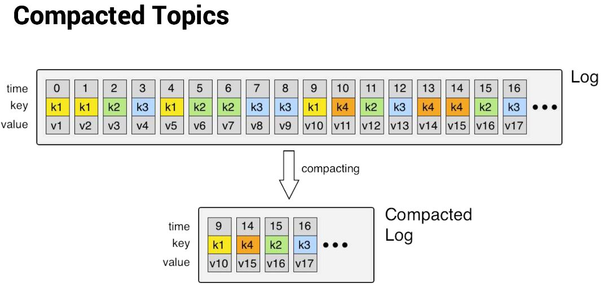

# Intro

### Intro

- Open-source stream-processing software platform by Apache Software Foundation
- Written in Scala and Java
- Aims to provide - Unified, High-throughput, low-latency platform for handling real-time data feeds.
- Storage layer - massively scalable pub/sub message queue designed as a distributed transaction log (highly valuable for enterprise infrastructures to process streaming data)
- Kafka connects to external systems (for data import/export) via Kafka Connect and provides Kafka Streams, a Java stream processing library
- Design is heavily influenced by [transaction logs](https://en.wikipedia.org/wiki/Transaction_log). (based on commit log)
- Fault tolerant highly available queue used in publisher-subscriber or streaming application
- It can deliver message exactly once and also it keeps all the messages ordered inside a partition of a topic
- Horizontally scalable, fault-tolerant, wicked fast
- Focuses on real-time analysis, not batch jobs
- Streams and streams only
- Except streams are also tables (sometimes)
- No cluster required
- Not just only a messaging framework but also a computation framework

### Application

- Building real-time streaming data pipelines that reliably get data between systems or applications
- Building real-time streaming applications that transform or react to the streams of data
- Publish and Subscribe - Read and write streams of data like a messaging system
- Process - Write scalable stream processing applications that react to events in real-time
- Store - Store streams of data safely in a distributed, replicated, fault-tolerant cluster

### Example Applications

1. Managing passenger and driver matching at Uber
2. Providing real-time analytics and predictive maintenance for British Gas' smart home
3. Performing numerous real-time services across all of LinkedIn
4. Streaming videos with persistence and consumer offset
5. For example, in a credit card transaction processing system, there will be a client application, perhaps an online store, responsible for sending each transaction to Kafka immediately when a payment is made. Another application is responsible for immediately checking this transaction against a rules engine and determining whether the transaction is approved or denied. The approve/deny response can then be written back to Kafka and the response can propagate back to the online store where the transaction was initiated. A third application can read both transactions and the approval status from Kafka and store them in a database where analysts can later review the decisions and perhaps improve the rules engine.

### Concepts

- Kafka is run as a cluster on one or more servers that can span multiple data-centers.
- The Kafka cluster stores streams of *records* in categories called *topics*.
- Each record consists of a key, a value, and a timestamp.

### APIs

- The [Producer API](https://kafka.apache.org/documentation.html#producerapi) allows an application to publish a stream of records to one or more Kafka topics.
- The [Consumer API](https://kafka.apache.org/documentation.html#consumerapi) allows an application to subscribe to one or more topics and process the stream of records produced to them.
- The [Streams API](https://kafka.apache.org/documentation/streams) allows an application to act as a *stream processor*, consuming an input stream from one or more topics and producing an output stream to one or more output topics, effectively transforming the input streams to output streams.
- The [Connector API](https://kafka.apache.org/documentation.html#connect) allows building and running reusable producers or consumers that connect Kafka topics to existing applications or data systems. For example, a connector to a relational database might capture every change to a table.

### Architecture

1. Message: an immutable array of bytes
2. Topic: a feed of messages
3. Producer: a process that publishes messages to a topic
4. Consumer: a single-threaded process that subscribes to a topic
5. Broker: one of the servers that comprises a cluster

## Use Cases

### Messaging

Kafka works well as a replacement for a more traditional message broker. Message brokers are used for a variety of reasons (to decouple processing from data producers, to buffer unprocessed messages, etc). In comparison to most messaging systems Kafka has better throughput, built-in partitioning, replication, and fault-tolerance which makes it a good solution for large scale message processing applications.

### Website Activity Tracking

The original use case for Kafka was to be able to rebuild a user activity tracking pipeline as a set of real-time publish-subscribe feeds. This means site activity (page views, searches, or other actions users may take) is published to central topics with one topic per activity type. These feeds are available for subscription for a range of use cases including real-time processing, real-time monitoring, and loading into Hadoop or offline data warehousing systems for offline processing and reporting.

Ex - Kafka can be used to **aggregate user activity** data such as clicks, navigation, and searches from different websites of an organization; such user activities can be sent to a real-time monitoring system and hadoop system for offline processing.

### Metrics

Kafka is often used for operational monitoring data. This involves aggregating statistics from distributed applications to produce centralized feeds of operational data.

### Log Aggregation

Many people use Kafka as a replacement for a log aggregation solution. Log aggregation typically collects physical log files off servers and puts them in a central place (a file server or HDFS perhaps) for processing. Kafka abstracts away the details of files and gives a cleaner abstraction of log or event data as a stream of messages. This allows for lower-latency processing and easier support for multiple data sources and distributed data consumption. In comparison to log-centric systems like Scribe or Flume, Kafka offers equally good performance, stronger durability guarantees due to replication, and much lower end-to-end latency.

### Stream Processing

Many users of Kafka process data in processing pipelines consisting of multiple stages, where raw input data is consumed from Kafka topics and then aggregated, enriched, or otherwise transformed into new topics for further consumption or follow-up processing. For example, a processing pipeline for recommending news articles might crawl article content from RSS feeds and publish it to an "articles" topic; further processing might normalize or deduplicate this content and published the cleansed article content to a new topic; a final processing stage might attempt to recommend this content to users. Such processing pipelines create graphs of real-time data flows based on the individual topics. Starting in 0.10.0.0, a light-weight but powerful stream processing library called [Kafka Streams](https://kafka.apache.org/documentation/streams) is available in Apache Kafka to perform such data processing as described above. Apart from Kafka Streams, alternative open source stream processing tools include [Apache Storm](https://storm.apache.org/) and [Apache Samza](http://samza.apache.org/).

### Event Sourcing

[Event sourcing](http://martinfowler.com/eaaDev/EventSourcing.html) is a style of application design where state changes are logged as a time-ordered sequence of records. Kafka's support for very large stored log data makes it an excellent backend for an application built in this style.

### Commit Log

Kafka can serve as a kind of external commit-log for a distributed system. The log helps replicate data between nodes and acts as a re-syncing mechanism for failed nodes to restore their data. The [**log compaction**](https://kafka.apache.org/documentation.html#compaction) feature in Kafka helps support this usage. In this usage Kafka is similar to [**Apache BookKeeper**](http://zookeeper.apache.org/bookkeeper/) project.

### Fintech

- Customer 360- getting a 360° view of customer interactions and delivering personalized customer experiences
   	- [Create an end-to-end data strategy for Customer 360 on AWS | AWS Big Data Blog](https://aws.amazon.com/blogs/big-data/create-an-end-to-end-data-strategy-for-customer-360-on-aws/)
- Credit Risk- Discovering and assessing risk profiles in real time, minimizing risk exposure on all financial products
- Real time fraud detection -Detecting anomalies in real time to identify potential fraudulent activities and meet regulatory requirements
- Operational agility- Accelerating business agility by increasing the flexibility of strategic applications

https://kafka.apache.org/uses

## ISR

in-sync replicas is the subset of the replicas list that is currently alive and caught up-to the leader

## Streams API

K-Stream , K-Table

https://kafka.apache.org/documentation/streams

## Managed Services

- Confluent Cloud - Apache Kafka as a service - https://www.confluent.io/confluent-cloud
- AWS - Amazon Kinesis Streams - https://aws.amazon.com/kafka - https://aws.amazon.com/kinesis
- Google Cloud - Confluent Cloud on GCP - https://cloud.google.com/blog/products/gcp/google-cloud-platform-and-confluent-partner-to-deliver-a-managed-apache-kafka-service

## Meet Kafka (Definitive Guide)

- Messages and Batches
    - Message
    - Key (byte array, used when messages are to be written to partitions in a more controlled manner)
    - Batches (Compressed)
- Schemas (JSON, Avro)
- Topics and Partitions
- Producers and Consumers
    - Kafka Connect API
    - Kafka Streams
    - offset (metadata - an integer value that continually increases)
    - consumer group (group ensures that each partition is only consumed by one member)
        - The mapping of a consumer to a partition is often called ownership of the partition by the consumer
- Brokers and Clusters
    - *leader* of the partition - cluster controller (elected automatically from the live member of the cluster)
    - retention
        - *log compacted,* which means that Kafka will retain only the last message produced with a specific key.
        - **Log compaction**

Log compaction is a mechanism to give finer-grained per-record retention, rather than the coarser-grained time-based retention. The idea is to selectively remove records where we have a more recent update with the same primary key. This way the log is guaranteed to have at least the last state for each key.

https://towardsdatascience.com/log-compacted-topics-in-apache-kafka-b1aa1e4665a7

- Multiple clusters
    - The replication mechanisms within the Kafka clusters are designed only to work within a single cluster, not between multiple clusters
- Named after writer *Franz Kafka*

## Apache Kafka 2.4

- Kafka Core
    - Allow consumers to fetch from closest replica (before this all reads and writes happened on the leader)
    - Implement admin API for replica reassignment
    - Sticky partitioner
    - Admin API for deleting consumers offset

https://www.confluent.io/blog/apache-kafka-2-4-latest-version-updates

## Kafka without Zookeeper (Kafka with KRaft Mode)

- KRaft Algorithm
- [Kafka Without ZooKeeper: A Sneak Peek At the Simplest Kafka Yet](https://www.confluent.io/blog/kafka-without-zookeeper-a-sneak-peek/)
- [KRaft - Apache Kafka Without ZooKeeper](https://developer.confluent.io/learn/kraft/)
- [Running Kafka without zookeeper. Kafka uses the Raft consensus algorithm… | by Kamini Kamal | Javarevisited | Medium](https://medium.com/javarevisited/running-kafka-without-zookeeper-66b685db4991)
- [Installing Apache Kafka without Zookeeper: Guide 101 | Hevo](https://hevodata.com/learn/kafka-without-zookeeper/)
- [Kafka without Zookeeper: Tutorial & Examples](https://redpanda.com/guides/kafka-tutorial/kafka-without-zookeeper)
- [KRaft Quorum: How to run Kafka without Zookeper](https://www.conduktor.io/blog/kraft-quorum-run-kafka-without-zookeeper/)

## Best Practices

- https://www.infoq.com/articles/apache-kafka-best-practices-to-optimize-your-deployment
- https://dzone.com/articles/20-best-practices-for-working-with-apache-kafka-at
- https://engineering.linkedin.com/kafka/benchmarking-apache-kafka-2-million-writes-second-three-cheap-machines
- https://www.datadoghq.com/blog/kafka-at-datadog

## References

- **[Kafkademy | Conduktor](https://www.conduktor.io/kafka/)**
- https://en.wikipedia.org/wiki/Apache_Kafka
- https://kafka.apache.org/intro
- https://thehoard.blog/how-kafkas-storage-internals-work-3a29b02e026
- https://scotch.io/tutorials/build-a-distributed-streaming-system-with-apache-kafka-and-python
- ISR (In-Sync Replica set) - https://engineering.linkedin.com/kafka/intra-cluster-replication-apache-kafka
- https://engineering.linkedin.com/kafka/benchmarking-apache-kafka-2-million-writes-second-three-cheap-machines
- https://www.confluent.io/blog/okay-store-data-apache-kafka
- https://engineering.linkedin.com/blog/2019/apache-kafka-trillion-messages
- https://engineeringblog.yelp.com/2020/01/streams-and-monk-how-yelp-approaches-kafka-in-2020.html
- https://www.waitingforcode.com/apache-kafka/apache-kafka-idempotent-producer/read
- [**https://kafkasummit.io/session-library/**](https://kafkasummit.io/session-library/)
- [Streamline Event-driven Microservices With Kafka and Python | Toptal](https://www.toptal.com/microservices/event-driven-microservices-kafka-python)
- [Apache Kafka Explained (Comprehensive Overview) - YouTube](https://www.youtube.com/watch?v=JalUUBKdcA0&ab_channel=Finematics)
- [How to Deploy Kafka using Kubernetes Kafka Operator](https://kubedb.com/articles/how-to-deploy-kafka-using-kubernetes-kafka-operator/)
