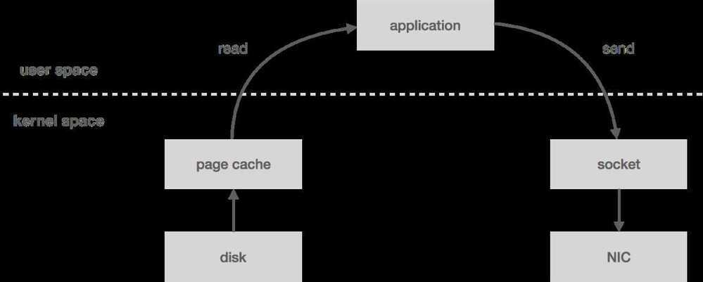
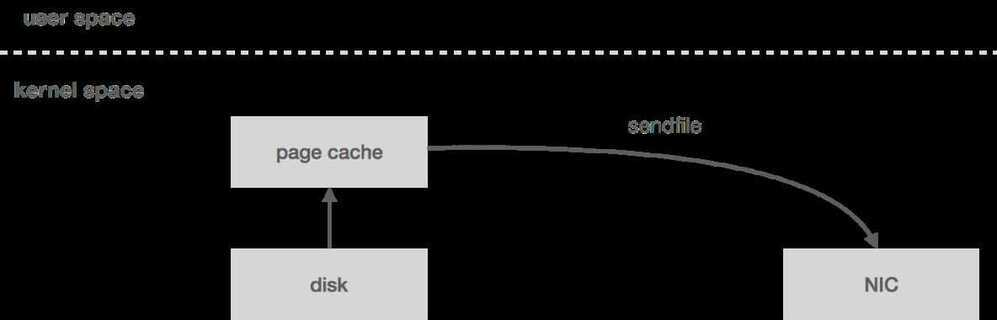

# Kafka Architecture

## Why is Kafka so Fast?

1. The first one is Kafka’s reliance on Sequential I/O.
2. The second design choice that gives Kafka its performance advantage is its focus on efficiency: zero copy principle.

Kafka relies heavily on the OS kernel to move data around quickly. It relies on the principals of [Zero Copy](https://en.wikipedia.org/wiki/Zero-copy). Kafka enables you to batch data records into chunks. These batches of data can be seen end to end from Producer to file system (Kafka Topic Log) to the Consumer. Batching allows for more efficient data compression and reduces I/O latency. Kafka writes to the immutable commit log to the disk sequential; thus, avoids random disk access, slow disk seeking. Kafka provides horizontal Scale through sharding. It shards a Topic Log into hundreds potentially thousands of partitions to thousands of servers. This sharding allows Kafka to handle massive load.

Zero-copy means that Kafka sends messages from the file (or more likely, the Linux filesystem cache) directly to the network channel without any intermediate buffers.

[ByteByteGo - YouTube](https://www.youtube.com/channel/UCZgt6AzoyjslHTC9dz0UoTw/community?lb=UgkxKPCx8UjOik2iB9rKHDWqgzv_y59aCrDW)

### Zero-copy

"**Zero-copy**" describes computer operations in which the [CPU](https://en.wikipedia.org/wiki/Central_processing_unit) does not perform the task of copying data from one [memory](https://en.wikipedia.org/wiki/RAM) area to another. This is frequently used to save CPU cycles and memory bandwidth when transmitting a file over a network.

### Kafka Zero Copy

Ideally, the data written to the log segment is written in protocol format. That is, what gets written to disk is exactly what gets sent over the wire. This allows for zero-copy reads. Let's take a look at how this otherwise works.

When you read messages from the log, the kernel will attempt to pull the data from the page cache. If it's not there, it will be read from disk. The data is copied from disk to page cache, which all happens in kernel space. Next, the data is copied into the application (i.e. user space). This all happens with the read system call. Now the application writes the data out to a socket using send, which is going to copy it back into kernel space to a socket buffer before it's copied one last time to the NIC. All in all, we have four copies (including one from page cache) and two system calls.

However, if the data is already in wire format, we can bypass user space entirely using the send filesystem call, which will copy the data directly from the page cache to the NIC buffer - two copies (including one from page cache) and one system call. This turns out to be an important optimization, especially in garbage-collected languages since we're bringing less data into application memory. Zero-copy also reduces CPU cycles and memory bandwidth.

### Other Optimizations - Messages batching & Compression

https://en.wikipedia.org/wiki/Zero-copy

https://bravenewgeek.com/building-a-distributed-log-from-scratch-part-1-storage-mechanics

## Concepts

- Zookeeper
- Producer
- Consumer
- Topic
- Topic Partition
- Consumer Group
- Offsets

Starting from version 0.8.2.0, the offsets committed by the consumers aren't saved in [ZooKeeper](https://dzone.com/articles/an-introduction-to-zookeeper-1) but on a partitioned and replicated topic named__consumer_offsets, which is hosted on the Kafka brokers in the cluster.

When a consumer commits some offsets (for different partitions), it sends a message to the broker to the__consumer_offsetstopic. The message has the following structure :

- key = [group, topic, partition]
- value = offset

- Kafka cluster
- Failovers
- ISRs
- Kafka disaster recovery

## Key concepts

| topic     | Defines a logical name for producing and consuming records.                       |
|------------|------------------------------------------------------------|
| partition | Defines a non-overlapping subset of records within a topic.                       |
| offset    | A unique sequential number assigned to each record within a topic partition.      |
| record    | A record contains a key, a value, a timestamp, and a list of headers.             |
| broker    | Servers where records are stored. Multiple brokers can be used to form a cluster. |

## Retention Policy

| **RETENTION POLICY** | **MEANING**                                          |
|-----------------------|-------------------------------------------------|
| log.retention.hours  | The number of hours to keep a record on the broker.  |
| log.retention.bytes  | The maximum size of records retained in a partition. |

## Kafka Internals (Definitive Guide)

- Cluster Membership
    - Kafka uses Apache Zookeeper to maintain the list of brokers that are currently members of a cluster
- Controller
    - The first broker that starts in the cluster becomes the controller by creating an ephemeral node in ZooKeeper called */controller.*
- Replication
    - **Two types of replicas**
        - Leader replica

Each partition has a single replica designated as the leader. All produce and consume requests go through the leader, in order to guarantee consistency.

- Follower replica

All replicas for a partition that are not leaders are called followers. Followers don't serve client requests; their only job is to replicate messages from the leader and stay up-to-date with the most recent messages the leader has. In the event that a leader replica for a partition crashes, one of the follower replicas will be promoted to become the new leader for the partition.

- Replicas that are consistently asking for the latest messages, is called *in-sync replicas*. Only in-sync replicas are eligible to be elected as partition leaders in case the existing leader fails.

- Request Processing
    - Most of what a Kafka broker does is process requests sent to the partition leaders from clients, partition replicas, and the controller.
    - For each port the broker listens on, the broker runs an *acceptor* thread that creates a connection and hands it over to a *processor* thread for handling. The number of processor threads (also called *network threads*) is configurable. The network threads are responsible for taking requests from client connections, placing them in a *request queue*, and picking up responses from a *response queue* and sending them back to clients.
    - Once requests are placed on the request queue, *IO threads* are responsible for picking them up and processing them. The most common types of requests are:
        - Produce requests

Sent by producers and contain messages the clients write to Kafka brokers.

- Fetch requests

Sent by consumers and follower replicas when they read messages from Kafka brokers.

- Physical Storage

The basic storage unit of Kafka is a partition replica.

- Partition allocation
- File management
- File format
- Indexes
- Compaction
- Deleted Events
    - tombstone

## Kafka Rebalancing Protocol

1. **Eager Rebalancing Protocol (Stop the world rebalancing)**
2. **Incremental cooperative rebalancing**
    - Incremental because the final desired state of rebalancing is reached in stages. A globally balanced final state does not have to be reached at the end of each round of rebalancing. A small number of consecutive rebalancing rounds can be used in order for the group of Kafka clients to converge to the desired state of balanced resources. In addition, you can configure a grace period to allow a departing member to return and regain its previously assigned resources.
    - Cooperative because each process in the group is asked to voluntarily release resources that need to be redistributed. These resources are then made available for rescheduling given that the client that was asked to release them does so on time

https://www.confluent.io/blog/incremental-cooperative-rebalancing-in-kafka

https://medium.com/streamthoughts/apache-kafka-rebalance-protocol-or-the-magic-behind-your-streams-applications-e94baf68e4f2

## Compression

compression.type: Specify the final compression type for a given topic. This configuration accepts the standard compression codecs ('gzip', 'snappy', 'lz4', 'zstd'). It additionally accepts 'uncompressed' which is equivalent to no compression; and 'producer' which means retain the original compression codec set by the producer

- **Type**: string
- **Default**: producer
- **Valid Values**: [uncompressed, zstd, lz4, snappy, gzip, producer]
- **Server Default Property**: compression.type
- **Importance**: medium

In Kafka compression, multiple messages are bundled and compressed. Then the compressed messages are turned into a special kind of message and appended to Kafka's log file. The reason to compress a batch of messages, rather than individual messages, is to increase compression efficiency, i.e., compressors work better with bigger data.

There are tradeoffs with enabling compression that should be considered. Compression, of course, saves space needed for data storage. On the other hand, it consumes extra computing resources, namely CPU cycles and memory, to perform compression. The use of compression should be therefore decided with consideration of the balance of cost and benefit. To make the compression applicable to wider usages of Kafka, we set out to improve Kafka compression support by reducing the cost.

https://www.confluent.io/blog/compression-in-apache-kafka-is-now-34-percent-faster

## Others

Another caveat with Kafka is unclean leader elections. That is, if all replicas become unavailable, there are two options: choose the first replica to come back to life (not necessarily in the ISR) and elect this replica as leader (which could result in data loss) or wait for a replica in the ISR to come back to life and elect it as leader (which could result in prolonged unavailability). Initially, Kafka favored availability by default by choosing the first strategy. If you preferred consistency, you needed to set *unclean.leader.election.enable* to *false*. However, as of 0.11, *unclean.leader.election.enable* now defaults to this.

## Others

- Idempotent Consumers
- Idempotent Producers

## References

http://cloudurable.com/blog/what-is-kafka/index.html

https://medium.com/swlh/why-kafka-is-so-fast-bde0d987cd03
