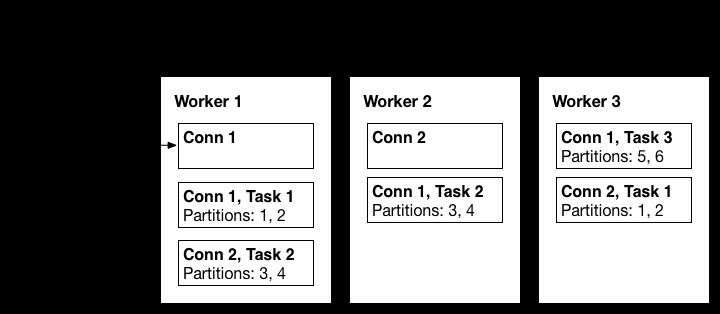
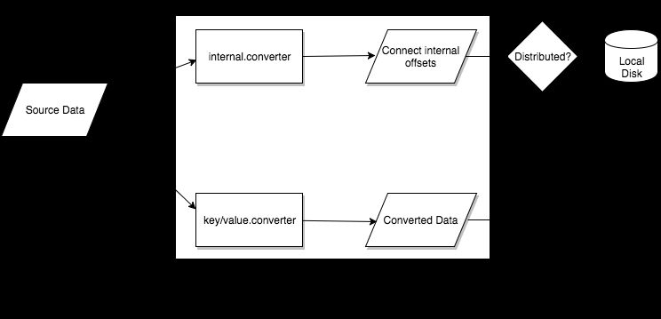

# Kafka Connect

## Kafka Connect (Definitive Guide)

- Connectors and tasks
    - Connectors
        - Determining how many tasks will run for the connector
        - Deciding how to split the data-copying work between the tasks
        - Getting configurations for the tasks from the workers and passing it along
    - Tasks
        - Tasks are responsible for actually getting the data in and out of Kafka
- Workers

Kafka Connect's worker processes are the "container' processes that execute the connectors and tasks

- Connectors and tasks are responsible for the "moving data" part of data integrations, while the workers are responsible for the REST API, configuration management, reliability, high availability, scaling, and load balancing

Kafka Connect is a tool for scalably and reliably streaming data between Apache Kafka and other systems. It makes it simple to quickly define *connectors*that move large collections of data into and out of Kafka. Kafka Connect can ingest entire databases or collect metrics from all your application servers into Kafka topics, making the data available for stream processing with low latency. An export job can deliver data from Kafka topics into secondary storage and query systems or into batch systems for offline analysis.

Kafka Connect features include:

- **A common framework for Kafka connectors** - Kafka Connect standardizes integration of other data systems with Kafka, simplifying connector development, deployment, and management
- **Distributed and standalone modes** - scale up to a large, centrally managed service supporting an entire organization or scale down to development, testing, and small production deployments
- **REST interface** - submit and manage connectors to your Kafka Connect cluster via an easy to use REST API
- **Automatic offset management** - with just a little information from connectors, Kafka Connect can manage the offset commit process automatically so connector developers do not need to worry about this error prone part of connector development
- **Distributed and scalable by default** - Kafka Connect builds on the existing group management protocol. More workers can be added to scale up a Kafka Connect cluster.
- **Streaming/batch integration** - leveraging Kafka's existing capabilities, Kafka Connect is an ideal solution for bridging streaming and batch data systems

## Kafka Connect currently supports two types of Workers

1. Standalone (single process)

Standalone mode is the simplest mode, where a single process is responsible for executing all connectors and tasks.

2. Distributed

Distributed mode provides scalability and automatic fault tolerance for Kafka Connect. In distributed mode, you start many worker processes using the samegroup.idand they automatically coordinate to schedule execution of connectors and tasks across all available workers. If you add a worker, shut down a worker, or a worker fails unexpectedly, the rest of the workers detect this and automatically coordinate to redistribute connectors and tasks across the updated set of available workers. Note the similarity to consumer group rebalance. Under the covers, connect workers are using consumer groups to coordinate and rebalance.



## Main components

- [Connectors](https://docs.confluent.io/current/connect/concepts.html#connect-connectors)-- the high level abstraction that coordinates data streaming by managing tasks
- [Tasks](https://docs.confluent.io/current/connect/concepts.html#connect-tasks)-- the implementation of how data is copied to or from Kafka
- [Workers](https://docs.confluent.io/current/connect/concepts.html#connect-workers)-- the running processes that execute connectors and tasks
- [Converters](https://docs.confluent.io/current/connect/concepts.html#connect-converters)-- the code used to translate data between Connect and the system sending or receiving data
- [Transforms](https://docs.confluent.io/current/connect/concepts.html#connect-transforms)-- simple logic to alter each message produced by or sent to a connector

## Task



## Connect REST API

https://docs.confluent.io/current/connect/references/restapi.html

Connect typically runs in distributed mode and can be managed through REST APIs. The following table shows the common APIs.

| **CONNECT REST API**          | **MEANING**                                              |
|--------------------------|----------------------------------------------|
| GET /connectors               | Return a list of active connectors                       |
| POST /connectors              | Create a new connector                                   |
| `GET /connectors/{name}`      | Get the information of a specific connector              |
| `GET /connectors/{name}/config` | Get configuration parameters for a specific connector    |
| `PUT /connectors/{name}/config` | Update configuration parameters for a specific connector |
| `GET /connectors/{name}/status` | Get the current status of the connector                  |

```bash
- GET /connectors- return a list of active connectors
- POST /connectors- create a new connector; the request body should be a JSON object containing a stringnamefield and an objectconfigfield with the connector configuration parameters
- GET /connectors/{name}- get information about a specific connector
- GET /connectors/{name}/config- get the configuration parameters for a specific connector
- PUT /connectors/{name}/config- update the configuration parameters for a specific connector
- GET /connectors/{name}/status- get current status of the connector, including if it is running, failed, paused, etc., which worker it is assigned to, error information if it has failed, and the state of all its tasks
- GET /connectors/{name}/tasks- get a list of tasks currently running for a connector
- GET /connectors/{name}/tasks/{taskid}/status- get current status of the task, including if it is running, failed, paused, etc., which worker it is assigned to, and error information if it has failed
- PUT /connectors/{name}/pause- pause the connector and its tasks, which stops message processing until the connector is resumed
- PUT /connectors/{name}/resume- resume a paused connector (or do nothing if the connector is not paused)
- POST /connectors/{name}/restart- restart a connector (typically because it has failed)
- POST /connectors/{name}/tasks/{taskId}/restart- restart an individual task (typically because it has failed)
- DELETE /connectors/{name}- delete a connector, halting all tasks and deleting its configuration
```

## Connectors

- Landoop mqtt source connector
- Confluent mqtt source connector

The connector requires a [Confluent enterprise license](https://www.confluent.io/product/confluent-enterprise/), which is stored inside Kafka in a topic. The connector must be configured with Kafka client configuration properties so that it can connect to Kafka and validate the license.

- Evokly open source mqtt connector

https://github.com/evokly/kafka-connect-mqtt

## Kafka Connect Query Language (KCQL)

https://github.com/Landoop/kafka-connect-query-language

## Commands

```bash
# using confluent mqtt source connector
docker exec kafka-connect curl -s -X POST -H "Content-Type: application/json" --data '{"name": "smap-mqtt-source", "config": {"connector.class": "io.confluent.connect.mqtt.MqttSourceConnector", "tasks.max":"1", "mqtt.server.uri":"tcp://emqx:1883", "mqtt.topics":"telemetry/#", "kafka.topic": "smap_telemetry_data",  "mqtt.username":"zenatix_mqtt_client", "mqtt.password":"xitanez123"}}' http://kafka-connect:8082/connectors

errors.log.enable = false
errors.log.include.messages = false
errors.retry.delay.max.ms = 60000
errors.retry.timeout = 0
errors.tolerance = none
header.converter = null
key.converter = null
name = smap-mqtt-source
tasks.max = 1
transforms = []
value.converter = null

# using lenses connector
docker exec kafka-connect curl -s -X POST -H "Content-Type: application/json" --data '{"name": "smap-mqtt-source-lenses", "config": {"connector.class": "com.datamountaineer.streamreactor.connect.mqtt.source.MqttSourceConnector", "tasks.max":"1", "connect.mqtt.hosts":"tcp://emqx:1883", "connect.mqtt.username":"zenatix_mqtt_client", "connect.mqtt.password":"xitanez123", "connect.mqtt.service.quality":"1", "connect.mqtt.kcql":"INSERT INTO smap_telemetry_data SELECT * FROM telemetry/+/+ WITHCONVERTER=`com.datamountaineer.streamreactor.connect.converters.source.BytesConverter`"}}' http://kafka-connect:8082/connectors

# validate configuration values
docker exec kafka-connect curl -s -X PUT -H "Content-Type: application/json" -d '{"name":"smap-mqtt-source","config": {"connector.class": "io.confluent.connect.mqtt.MqttSourceConnector", "tasks.max":"1", "mqtt.server.uri":"tcp://emqx:1883", "mqtt.username":"zenatix_mqtt_client", "mqtt.password":"xitanez123", "mqtt.topic":"smap_telemetry_data", "kafka.topic": "smap_telemetry_data"}}' http://kafka-connect:8082/connector-plugins/MqttSourceConnector/config/validate

# list all connector available
docker exec kafka-connect curl -s -X GET http://kafka-connect:8082/connectors/
docker exec kafka-connect curl -s -X GET http://kafka-connect:8082/connector-plugins/

# get status of a connector
docker exec kafka-connect curl -s -X GET http://kafka-connect:8082/connectors/smap-mqtt-source status

# delete connector
docker exec kafka-connect curl -X DELETE http://kafka-connect:8082/connectors/smap-mqtt-source

#Updating a connector config
curl -s -X PUT -H "Content-Type:application/json" --data '{"connector.class": "com.datamountaineer.streamreactor.connect.mqtt.source.MqttSourceConnector", "tasks.max":"1", "connect.mqtt.hosts":"tcp://mqtt.vernemq:1883", "connect.mqtt.username":"zenatix_mqtt_client", "connect.mqtt.password":"xitanez123", "connect.mqtt.service.quality":"1", "connect.mqtt.clean":"false", "connect.mqtt.kcql":"INSERT INTO smap_telemetry_data SELECT * FROM telemetry/+/+ WITHCONVERTER=`com.datamountaineer.streamreactor.connect.converters.source.BytesConverter`"}' http://ke-cp-kafka-connect.kafka:8083/connectors/smap-mqtt-source-lenses/config
```

## Lenses Source Mqtt Connector

### Configurations

- Kafka Connect framework configurations
    - name
    - tasks.max (1)

- connector.class (com.datamountaineer.streamreactor.connect.mqtt.source.MqttSourceConnector)

- Connector Configurations
    - connect.mqtt.ksql
    - connect.mqtt.hosts

- Optional Configurations

    - connect.mqtt.service.quality (default - 1)

    - connect.mqtt.username

    - connect.mqtt.password

    - connect.mqtt.client.id

    - connect.mqtt.timeout (default - 3000ms)

    - connect.mqtt.clean (default - true)

    - connect.mqtt.keep.alive (default - 5000)

    - connect.mqtt.converter.throw.on.error (default - false)

    - connect.converter.avro.schemas

    - connect.progress.enabled

### Commands

```bash
curl -s -X POST -H "Content-Type: application/json" --data '{"name": "bench-test", "config": {"connector.class": "com.datamountaineer.streamreactor.connect.mqtt.source.MqttSourceConnector", "tasks.max":"1", "connect.mqtt.hosts":"tcp://mqtt.vernemq:1883", "connect.mqtt.username":"example_mqtt_client", "connect.mqtt.password":"xitanez123", "connect.mqtt.client.id":"bench-test-client-id", "connect.mqtt.service.quality":"1", "connect.mqtt.clean":"false", "connect.mqtt.kcql":"INSERT INTO bench_data SELECT * FROM bench/+ WITHCONVERTER=`com.datamountaineer.streamreactor.connect.converters.source.BytesConverter`"}}'
```

http://ke-cp-kafka-connect.kafka:8083/connectors

https://docs.lenses.io/connectors/source/mqtt.html

## Simple Message Transformations SMT

These single message transforms (SMTs) are available for use with Kafka Connect:

| **Transform** | **Description** |
|:---:|:---:|
| [Cast](https://docs.confluent.io/current/connect/transforms/cast.html#cast) | Cast fields or the entire key or value to a specific type, e.g. to force an integer field to a smaller width. |
| [ExtractField](https://docs.confluent.io/current/connect/transforms/extractfield.html#extractfield) | Extract the specified field from a Struct when schema present, or a Map in the case of schemaless data. Any null values are passed through unmodified. |
| [ExtractTopic](https://docs.confluent.io/current/connect/transforms/extracttopic.html#extracttopic) | Replace the record topic with a new topic derived from its key or value. |
| [Flatten](https://docs.confluent.io/current/connect/transforms/flatten.html#flatten) | Flatten a nested data structure. This generates names for each field by concatenating the field names at each level with a configurable delimiter character. |
| [HoistField](https://docs.confluent.io/current/connect/transforms/hoistfield.html#hoistfield) | Wrap data using the specified field name in a Struct when schema present, or a Map in the case of schemaless data. |
| [InsertField](https://docs.confluent.io/current/connect/transforms/insertfield.html#insertfield) | Insert field using attributes from the record metadata or a configured static value. |
| [MaskField](https://docs.confluent.io/current/connect/transforms/maskfield.html#maskfield) | Mask specified fields with a valid null value for the field type. |
| [RegexRouter](https://docs.confluent.io/current/connect/transforms/regexrouter.html#regexrouter) | Update the record topic using the configured regular expression and replacement string. |
| [ReplaceField](https://docs.confluent.io/current/connect/transforms/replacefield.html#replacefield) | Filter or rename fields. |
| [SetSchemaMetadata](https://docs.confluent.io/current/connect/transforms/setschemametadata.html#setschemametadata) | Set the schema name, version, or both on the record's key or value schema. |
| [TimestampConverter](https://docs.confluent.io/current/connect/transforms/timestampconverter.html#timestampconverter) | Convert timestamps between different formats such as Unix epoch, strings, and Connect Date and Timestamp types. |
| [TimestampRouter](https://docs.confluent.io/current/connect/transforms/timestamprouter.html#timestamprouter) | Update the record's topic field as a function of the original topic value and the record timestamp. |
| [ValueToKey](https://docs.confluent.io/current/connect/transforms/valuetokey.html#valuetokey) | Replace the record key with a new key formed from a subset of fields in the record value. |

## References

https://docs.confluent.io/current/connect/userguide.html

https://kafka.apache.org/documentation.html#connect

https://kafka.apache.org/documentation/#connectapi

https://docs.confluent.io/current/installation/docker/docs/installation/single-node-client.html#step-7-start-kafka-connect

https://docs.confluent.io/current/connect/transforms/index.html
