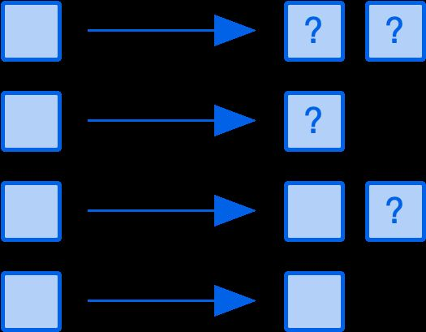

# Kafka Guarantees

## Message Processing Guarantees

- **No guarantee -** No explicit guarantee is provided, so consumers may process messages once, multiple times or never at all.
- **At most once -** This is "best effort" delivery semantics. Consumers will receive and process messages exactly once or not at all.
- **At least once -** Consumers will receive and process every message, but they may process the same message more than once.
- **Effectively once -** Also [contentiously](https://streaml.io/blog/exactly-once) [known](https://medium.com/@jaykreps/exactly-once-support-in-apache-kafka-55e1fdd0a35f) as exactly once, this promises consumers will process every message once.



## Exactly Once Semantics (EOS)

### Key Building Blocks for EOS

Kafka achieves **EOS** using three main features:

#### (a) Idempotent Producer

- Every message sent by a producer gets a **producer ID (PID)** and a **sequence number**.
- If retries happen (e.g., network glitch), Kafka detects duplicates by checking the sequence number and ignores them.
- Ensures **no duplicates on retries** → gives **idempotent writes**.

#### (b) Transactions

- A producer can group multiple writes (to one or more partitions, topics) into a **transaction**.
- Kafka ensures that either:
    - All writes in the transaction are committed, or
    - None are (atomicity).
- Consumers using **read_committed** isolation see only committed data.

#### (c) Replication Protocol

- With `acks=all`, Kafka ensures that once a transaction is committed, it’s **durably replicated to all in-sync replicas (ISRs)**.
- This guarantees durability even if the leader fails immediately after commit.

### Putting It Together

Here’s how EOS works in practice:

1. **Producer** starts a transaction → `initTransactions()`.
2. Writes messages with **idempotence enabled**.
3. Calls `commitTransaction()` → Kafka writes a **transaction marker** ensuring atomic visibility.
4. Messages are replicated to all ISRs (with `acks=all`).
5. **Consumer** reads with `isolation.level=read_committed` → sees each committed message **exactly once**.

### Limitations

- EOS works **only within Kafka** (end-to-end with producers + Kafka + consumers).
- If you write to an external DB/system, you need **two-phase commit or outbox patterns**.
- Slight overhead due to transaction coordination.

## Replication Protocol

- When a **producer** writes a message to a partition, it first goes to the **leader replica** of that partition.
- The producer can specify the **acks** setting:
    
    - `acks=0` → Producer doesn’t wait for acknowledgment.
    - `acks=1` → Producer gets an acknowledgment once the leader writes it.
    - `acks=all` (or `-1`) → Producer gets acknowledgment only after the message is written to the leader **and** replicated to all **in-sync replicas (ISRs)**.

**Important nuance**: Kafka does **not** guarantee replication to _all available replicas_ after the leader write. Instead, it guarantees replication to the set of **in-sync replicas (ISRs)**.

- If a follower is **out of sync**, it won’t block the acknowledgment.
- As long as at least one ISR (typically the leader + followers in sync) has the message, Kafka considers it durable.

> Kafka’s replication protocol guarantees that once a message has been acknowledged with `acks=all`, it has been written successfully to the leader replica and replicated to all in-sync replicas (ISRs).

## Outbox Pattern

The **Outbox Pattern** is one of the most popular patterns used to achieve **reliable event-driven integration** between a database (like MySQL, PostgreSQL) and a message broker (like Kafka).

### Problem it Solves

When a service needs to:

1. Update its **own database** (say insert a new `Order`), and
2. Publish an **event to Kafka** (like `OrderCreated`)

You run into the **dual-write problem**:

- If you write to the DB but crash before publishing to Kafka → event is lost.
- If you publish to Kafka but crash before writing to DB → system state is inconsistent.

This breaks **exactly-once semantics across DB + Kafka**.

### The Outbox Pattern

Instead of doing both separately, you write **only to your database** in a single atomic transaction:

1. Service writes **business data** (e.g., new `Order`)
2. In the **same transaction**, service writes an **event record** into a special `outbox` table.

Example (Postgres/MySQL):

```sql
BEGIN;
INSERT INTO orders (id, customer, amount, status) VALUES (123, 'Deepak', 1000, 'CREATED');
INSERT INTO outbox (event_id, type, payload, status) VALUES (uuid(), 'OrderCreated', '{"id":123,"amount":1000}', 'NEW');
COMMIT;
```

Now DB and event are **guaranteed consistent**.

### Event Relay (Debezium / Polling)

Next step:

- A **relay process** reads events from the `outbox` table and publishes them to Kafka.
- Can be done via:
    - **Change Data Capture (CDC)** tools like **Debezium** (reads DB transaction log, automatically streams outbox rows to Kafka).
    - **Polling** (a background service queries the outbox table and sends events).

After publishing, event status can be marked as `SENT` or the row can be archived.

### Benefits

- **Atomicity** → DB update + event log are one transaction.
- **Reliability** → No lost or duplicated events.
- **Event-driven architecture** works smoothly with existing DB.
- Plays well with **Kafka + EOS** when you integrate external systems.

### Example Flow

**Order Service**:

- User places order.
- Service saves order + inserts event into outbox table.
- Debezium streams outbox → Kafka topic `order.events`.

**Inventory Service**:

- Consumes from `order.events`.
- Updates stock accordingly.

## Outbox to Kafka - EOS

### 1. The Challenge

- The **outbox table** is already atomic with your business data.
- But when your **producer service** reads from the outbox and publishes to Kafka, two risks appear:
    1. **Duplicate sends** (retry on failure, service crash before marking event as sent).
    2. **Lost events** (service marks row as sent, but crash happens before actually producing to Kafka).

We need EOS here.

### 2. Solution Approaches

#### Approach A: **Kafka Transactions (EOS Producer)**

Kafka has **idempotent producers + transactions**:

- Configure the producer with:
	- `enable.idempotence=true`
	- `acks=all`
	- `transactional.id=outbox-relay-1`
- Start a **transaction**:
    1. Read batch of unsent events from outbox table.
    2. Begin Kafka transaction.
    3. Send all events to Kafka.
    4. Commit Kafka transaction **AND** update outbox table status (`sent=true`) in the **same transactional flow**.

👉 But here’s the catch: Kafka transactions and DB transactions are separate. You **cannot** commit both atomically in one step.

So you need a **transactional outbox + idempotent updates** pattern.

#### Approach B: **Idempotent Deduplication Key**

Each event in outbox has a **unique event_id (UUID)**.

- Use `event_id` as **Kafka message key** (or put it in headers).
- Kafka producer with idempotence ensures retries don’t create duplicates.
- Consumers can deduplicate by `event_id` if needed.

#### Approach C: **Debezium / CDC Outbox (Best Practice)**

Instead of writing custom relay code:

- Use **Debezium** (reads DB’s transaction log).
- When your service commits the DB transaction (business row + outbox row), Debezium streams the outbox change directly into Kafka.
- This is already **exactly-once** because:
    
    - DB transaction log guarantees no duplicates.
    - Kafka’s EOS producer (in Debezium) guarantees idempotence.

This avoids the "dual-write" problem entirely.

### 3. Practical Design (if writing custom relay service)

1. Outbox row has:
    `event_id (UUID, PK), payload, status, created_at`
2. Relay service logic:
    - Poll outbox rows where `status='NEW'`.
    - Start Kafka transaction.
    - For each row:
        `producer.send(new ProducerRecord("topic", event_id, payload));`
    - Commit Kafka transaction.
    - After successful commit, mark those rows as `SENT`.
3. If crash happens:
    - Rows still marked `NEW` → safe to retry.
    - Kafka idempotence + unique key ensure no duplicates.

### 4. Key Points

- **Idempotence in Kafka** removes duplicates caused by retries.
- **Outbox status column** ensures no message is lost.
- **CDC (Debezium)** is the cleanest and production-proven way.
- If you roll your own relay, you must use **idempotent producer + unique event_id**.

👉 So, **the safest way** to ensure EOS from Outbox → Kafka is:

- Use **CDC (Debezium Outbox pattern)** if possible.
- If using a custom service, use **Kafka idempotent producer with unique event_id** + mark rows after commit.
