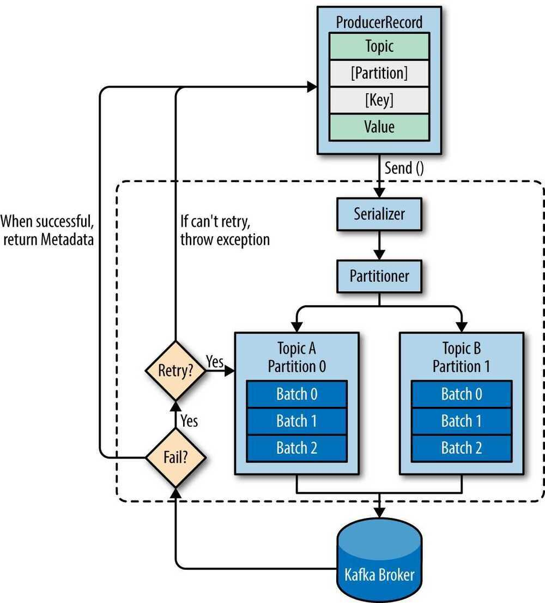
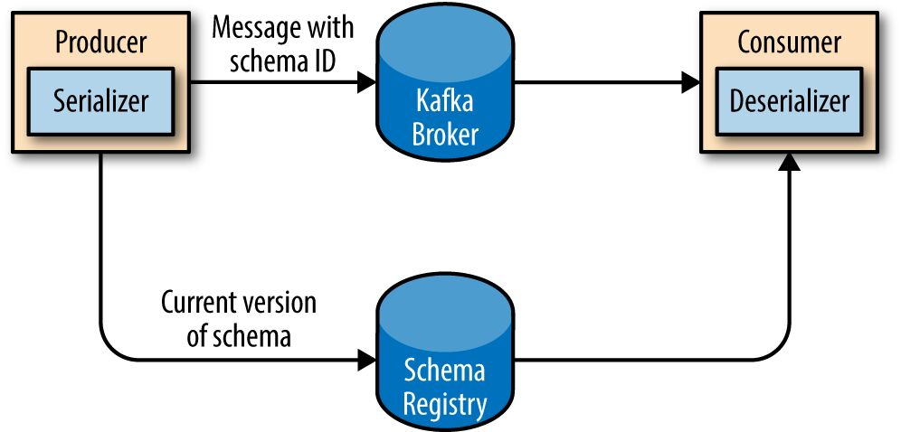

# Kafka Producers

The producer is the creator of the message in Kafka

- The producers place the message to a particular topic
- The producers also decide which partition to place the message into
- Topics should already exist before a message is placed by the producer
- Messages are added at one end of the partition

- We start producing messages to Kafka by creating a ProducerRecord, which must include the topic we want to send the record to and a value. Optionally, we can also specifiy a key and/or a partition. Once we send the ProducerRecord, the first thing the producer will do is serialize the key and value objects to ByteArrays so they can be send over the network.
- Next, the data is sent to a partitioner. If we specified a partition in the ProducerRecord, the partitioner doesn't do anything and simply returns the partition we specified. If we didn't, the partitioner will choose a partition for us, usually based on the ProducerRecord key. Once a partition is selected, the producer knows which topic and partition the record will go to. It then adds the record to a batch of records that will also be sent to the same topic and partition. A separate thread is responsible for sending those batches of records to the appropriate Kafka brokers.
- When the broker receives the messages, it sends back a response. If the messages were successfully written to Kafka, it will return a RecordMetadata object with the topic, partition, and the offset of the record within the partition. If the broker failed to write the messages, it will return an error. When the producer receives an error, it may retry sending the message a few more times before giving up and returning an error.

### Configurations

- bootstrap.servers
- key.serializer
- value.serializer
- acks [0, 1 (when leader has received the message), all]
- buffer.memory
- compression.type
- retries
- batch.size
- linger.ms
- client.id
- max.in.flight.requests.per.connection
- timeout.ms, request.timeout.ms, and metadata.fetch.timeout.ms
- max.block.ms
- max.request.size
- receive.buffer.bytes and send.buffer.bytes

### Three primary methods of sending messages

#### Fire-and-forget

We send a message to the server and don't really care if it arrives succesfully or not. Most of the time, it will arrive successfully, since Kafka is highly available and the producer will retry sending messages automatically. However, some mes‐ sages will get lost using this method

#### Synchronous send

We send a message, the send() method returns a Future object, and we use get() to wait on the future and see if the send() was successful or not

#### Asynchronous send

We call the send() method with a callback function, which gets triggered when it receives a response from the Kafka broker

- *ProducerRecord*
- Handling Errors
- Configuration options
- Different Partitioning Methods, partitioners

### Serializers

- Thrift
- Protobuf

#### Avro

One of the most interesting features of Avro, and what makes it a good fit for use in a messaging system like Kafka, is that when the application that is writing messages switches to a new schema, the application reading the data can continue processing messages without requiring any change or update.

- Kafka has a binary wire protocol, so anyone can read messages from Kafka or write messages to Kafka simply by sending the correct byte sequences to Kafka's network port.

### Using Avro records with Kafka

- Unlike Avro files, where storing the entire schema in the data file is associated with a fairly reasonable overhead, storing the entire schema in each record will usually more than double the record size. However, Avro still requires the entire schema to be present when reading the record, so we need to locate the schema elsewhere. To achieve this, we follow a common architecture pattern and use a *Schema Registry*.
- The idea is to store all the schemas used to write data to Kafka in the registry. Then we simply store the identifier for the schema in the record we produce to Kafka. The consumers can then use the identifier to pull the record out of the schema registry and deserialize the data. The key is that all this work - storing the schema in the reg‐ istry and pulling it up when required - is done in the serializers and deserializers. The code that produces data to Kafka simply uses the Avro serializer just like it would any other serializer.
- 
- **Partitions**
    - Keys serve two goals: they are additional information that gets stored with the message, and they are also used to decide which one of the topic partitions the message will be written to. All messages with the same key will go to the same partition.

## Links

https://www.jesseyates.com/2020/01/01/high-performance-kafka-producers.html

[Tutorial: How to Tune the Kafka Producer Client](https://developer.confluent.io/courses/architecture/producer-hands-on/)

[How to optimize your Kafka producer for throughput using Confluent](https://developer.confluent.io/tutorials/optimize-producer-throughput/confluent.html)
