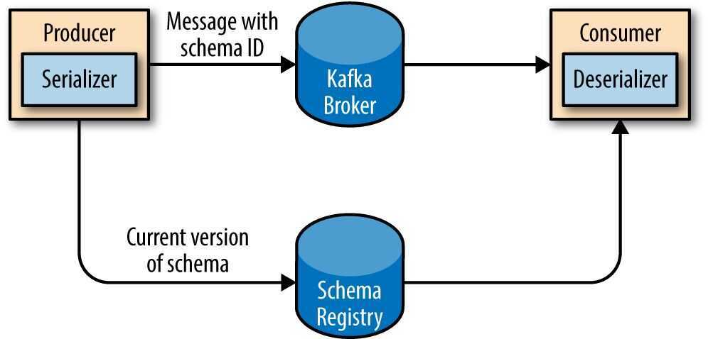

# Kafka Producers

The producer is the creator of the message in Kafka

- The producers place the message to a particular topic
- The producers also decide which partition to place the message into
- Topics should already exist before a message is placed by the producer
- Messages are added at one end of the partition

- We start producing messages to Kafka by creating a ProducerRecord, which must include the topic we want to send the record to and a value. Optionally, we can also specifiy a key and/or a partition. Once we send the ProducerRecord, the first thing the producer will do is serialize the key and value objects to ByteArrays so they can be send over the network.
- Next, the data is sent to a partitioner. If we specified a partition in the ProducerRecord, the partitioner doesn't do anything and simply returns the partition we specified. If we didn't, the partitioner will choose a partition for us, usually based on the ProducerRecord key. Once a partition is selected, the producer knows which topic and partition the record will go to. It then adds the record to a batch of records that will also be sent to the same topic and partition. A separate thread is responsible for sending those batches of records to the appropriate Kafka brokers.
	- Kafka's default partitioner routes messages based on the k**ey's hash, unless the key is null in which case it uses round robin to distribute messages.**
- When the broker receives the messages, it sends back a response. If the messages were successfully written to Kafka, it will return a RecordMetadata object with the topic, partition, and the offset of the record within the partition. If the broker failed to write the messages, it will return an error. When the producer receives an error, it may retry sending the message a few more times before giving up and returning an error.

## Configurations

- bootstrap.servers
- key.serializer
- value.serializer
- acks `[0, 1 (when leader has received the message), all]`
- buffer.memory
- compression.type
- retries
- batch.size
- linger.ms
- client.id
- max.in.flight.requests.per.connection
- timeout.ms, request.timeout.ms, and metadata.fetch.timeout.ms
- max.block.ms
- max.request.size
- receive.buffer.bytes and send.buffer.bytes

## Three primary methods of sending messages

### Fire-and-forget

We send a message to the server and don't really care if it arrives succesfully or not. Most of the time, it will arrive successfully, since Kafka is highly available and the producer will retry sending messages automatically. However, some messages will get lost using this method

### Synchronous send

We send a message, the send() method returns a Future object, and we use get() to wait on the future and see if the send() was successful or not

### Asynchronous send

We call the send() method with a callback function, which gets triggered when it receives a response from the Kafka broker

- *ProducerRecord*
- Handling Errors
- Configuration options
- Different Partitioning Methods, partitioners

## Serializers

- Thrift
- Protobuf

### Avro

One of the most interesting features of Avro, and what makes it a good fit for use in a messaging system like Kafka, is that when the application that is writing messages switches to a new schema, the application reading the data can continue processing messages without requiring any change or update.

- Kafka has a binary wire protocol, so anyone can read messages from Kafka or write messages to Kafka simply by sending the correct byte sequences to Kafka's network port.

### Using Avro records with Kafka

- Unlike Avro files, where storing the entire schema in the data file is associated with a fairly reasonable overhead, storing the entire schema in each record will usually more than double the record size. However, Avro still requires the entire schema to be present when reading the record, so we need to locate the schema elsewhere. To achieve this, we follow a common architecture pattern and use a *Schema Registry*.
- The idea is to store all the schemas used to write data to Kafka in the registry. Then we simply store the identifier for the schema in the record we produce to Kafka. The consumers can then use the identifier to pull the record out of the schema registry and deserialize the data. The key is that all this work - storing the schema in the reg‐ istry and pulling it up when required - is done in the serializers and deserializers. The code that produces data to Kafka simply uses the Avro serializer just like it would any other serializer.

- **Partitions**
    - Keys serve two goals: they are additional information that gets stored with the message, and they are also used to decide which one of the topic partitions the message will be written to. All messages with the same key will go to the same partition.

## Partitioners - Dynamic Partition Assignment

In dynamic multi-tenant environments, tenants might not have equal traffic. Some tenants may generate a high volume of messages, while others contribute minimally. Using dynamic partition assignment with tenant IDs can help distribute messages evenly by adjusting partition counts and reassigning tenants dynamically.

- **Load Balancing:** This helps avoid overloaded partitions when certain tenants generate more traffic. Kafka can handle dynamic rebalancing based on the load, ensuring fair distribution across partitions.
- **Hotspot Prevention:** Dynamic reassignment mitigates the risk of certain partitions becoming "hotspots" due to uneven traffic from larger tenants.

It is important to clarify a key architectural distinction upfront: Standard Apache Kafka **does not** automatically reassign specific Tenant IDs to different partitions based on live traffic load out of the box.

The capability you described—dynamically routing specific tenants to specific partitions based on their real-time volume—is achieved through an architectural pattern often called **"Smart Partitioning"** or **"Virtual Partitioning."**

This is achieved by moving away from the default hashing mechanism (`hash(TenantID) % PartitionCount`) and implementing a control layer that dictates exactly where each tenant's data goes.

Here is the detailed breakdown of how this architecture is achieved.

### 1. The Core Architecture: Decoupling Logical from Physical

In a standard setup, a tenant is permanently bound to a partition by their ID. In a **Dynamic Assignment** setup, you introduce a layer of indirection.

#### A. The Metadata Store (The "Brain")

You maintain a separate "Routing Table" or "State Store" (often kept in a fast database like Redis, Zookeeper, or a compacted Kafka topic). This table maps **Logical Tenant IDs** to **Physical Partition IDs**.

|**Tenant ID**|**Assigned Partition(s)**|**Status**|
|---|---|---|
|Tenant_A (Small)|Partition 0|Shared|
|Tenant_B (Small)|Partition 0|Shared|
|**Tenant_C (Huge)**|**Partition 1, 2, 3**|**Dedicated/Sharded**|
|Tenant_D (Medium)|Partition 4|Dedicated|

#### B. The Smart Producer (Custom Partitioner)

You must implement a **Custom Partitioner** in your Kafka Producer configuration.

1. **Fetch Map:** When the producer starts (and periodically afterwards), it fetches the "Routing Table" from the Metadata Store.
2. **Intercept Record:** When a message comes in for `Tenant_C`, the producer does *not* hash the ID.
3. **Look up:** It looks at its local cache of the table: *"Where does Tenant_C go currently?"*
4. **Dispatch:** It sees `Tenant_C` is assigned to Partitions 1, 2, and 3. It then uses a round-robin or sticky strategy to send the message to one of those specific partitions.

### 2. Achieving Hotspot Prevention & Load Balancing

Here is the workflow for how the system dynamically adjusts to traffic spikes (Hotspot Prevention):

#### Step 1: Observation (The Metrics)

An external monitoring process (The "Observer") watches the throughput metrics of the topics.

- *Scenario:* `Tenant_A` was small and shared Partition 0 with 50 other tenants. Suddenly, `Tenant_A` starts sending 10,000 events/sec.
- *Alert:* Partition 0 lag spikes, and the Observer identifies `Tenant_A` as the source of the volume.

#### Step 2: Decision (The Reassignment)

The Observer decides to isolate `Tenant_A` to prevent it from starving the other small tenants on Partition 0.

1. It selects a currently under-utilized partition (e.g., Partition 5).
2. It updates the **Metadata Store**:
    - `Tenant_A` -> `Partition 5`
3. (Optional) If `Tenant_A` is too big for *any* single partition, the Observer assigns it multiple partitions (`Partition 5, 6, 7`).

#### Step 3: Propagation

The Kafka Producers (which are polling the Metadata Store for updates) detect the change. They update their internal routing map.

#### Step 4: Execution

The very next message produced for `Tenant_A` is routed directly to Partition 5. Partition 0 cools down, and the other tenants there return to normal latency.

### 3. Advanced Strategies for "Elephant" Tenants

The prompt mentions "reassigning tenants." There are two main ways to handle a tenant that becomes too large:

#### 1. Tenant Isolation (Dedicated Partition)

You give the high-volume tenant their own partition. This ensures their traffic does not impact the "Noisy Neighbor" tenants, and their consumer lag does not delay the processing of other tenants' data.

#### 2. Tenant Sharding (Sub-Partitioning)

If a single tenant produces more data than a single partition/consumer can handle (e.g., 50MB/s), mapping them to one partition isn't enough.

- **Technique:** The Metadata Store assigns `Tenant_Huge` to a **list** of partitions: `[10, 11, 12]`.
- **Producer Logic:** When sending data for `Tenant_Huge`, the producer uses a secondary key (like `UserID` or `TransactionID` within that tenant) to round-robin across partitions 10, 11, and 12. This allows you to consume that single tenant's data in parallel.

### 4. Critical Challenge: The Ordering Guarantee

There is a massive trade-off you must manage: **Message Ordering.**

Kafka only guarantees ordering *within* a partition. If you dynamically move `Tenant_A` from Partition 0 to Partition 5:

1. Messages 1-100 are on Partition 0 (waiting to be consumed).
2. You switch the map.
3. Message 101 goes to Partition 5.
4. If the consumer for Partition 5 is faster than the consumer for Partition 0, **Message 101 might be processed before Message 100.**

**How to solve this?**

- **The "Stop-and-Wait" Approach:** The system must signal the producer to stop sending data for `Tenant_A`, wait for Partition 0 to be fully consumed (lag = 0), and *then* update the map to point to Partition 5.
- **Accepting Out-of-Order:** For some use cases (e.g., logging), strict ordering isn't required, and you can switch immediately.

### Summary of Components

|**Component**|**Responsibility in Dynamic Assignment**|
|---|---|
|**Metrics Collector**|Monitors throughput per tenant/partition to detect hotspots.|
|**Control Plane**|Calculates fair distribution and updates the Tenant-to-Partition map.|
|**Metadata Store**|Holds the "Source of Truth" map (e.g., Zookeeper, Redis).|
|**Smart Producer**|Consults the map to route messages to the correct physical partition.|

## Links

- https://www.jesseyates.com/2020/01/01/high-performance-kafka-producers.html
- [Tutorial: How to Tune the Kafka Producer Client](https://developer.confluent.io/courses/architecture/producer-hands-on/)
- [How to optimize your Kafka producer for throughput using Confluent](https://developer.confluent.io/tutorials/optimize-producer-throughput/confluent.html)
