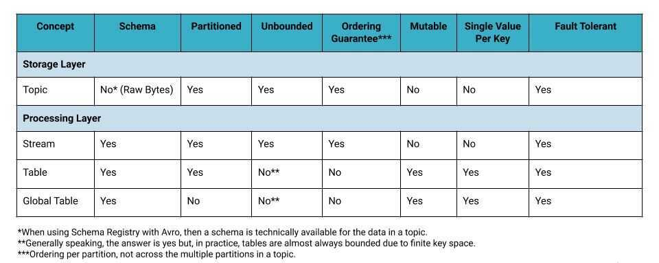

# Kafka Streams

Topics live in Kafka's storage layer - they are part of the Kafka "filesystem" powered by the brokers. In contrast, streams and tables are concepts of Kafka's processing layer, used in tools like [ksqlDB](https://ksqldb.io/) and [Kafka Streams](https://docs.confluent.io/current/streams/index.html). These tools process your events stored in "raw" topics by turning them into streams and tables - a process that is conceptually very similar to how a relational database turns the bytes in files on disk into an RDBMS table for you to work with.

An event stream in Kafka is a topic with a schema. Keys and values of events are no longer opaque byte arrays but have specific types, so we know what's in the data. Like a topic, a stream is unbounded.

https://www.confluent.io/blog/kafka-streams-tables-part-3-event-processing-fundamentals

Kafka Streams is a client library for processing and analyzing data stored in Kafka. It builds upon important stream processing concepts such as properly distinguishing between event time and processing time, windowing support, exactly-once processing semantics and simple yet efficient management of application state.

Kafka Streams has a **low barrier to entry**: You can quickly write and run a small-scale proof-of-concept on a single machine; and you only need to run additional instances of your application on multiple machines to scale up to high-volume production workloads. Kafka Streams transparently handles the load balancing of multiple instances of the same application by leveraging Kafka's parallelism model.

## KSTREAM VS. KTABLE

There are two key concepts in Kafka Streams: KStream and KTable. A topic can be viewed as either of the two. Their differences are summarized in the table below.

|            | **KSTREAM**                                        | **KTABLE**                                             |
|-----------|------------------------------|-------------------------------|
| **CONCEPT** | Each record is treated as an append to the stream. | Each record is treated as an update to an existing key |
| **USAGE**   | Model append-only data such as click streams.      | Model updatable reference data such as user profiles   |

The following example illustrates the difference between the two:

| (key , value) records | Sum of values As KStream | Sum of values As KTable |
|-----------------------|--------------------------|-------------------------|
| ("k1", 2) ("k1", 5)   | 7                        | 5                       |

When a topic is viewed as a KStream, there are two independent records and thus the sum of the values is 7. On the other hand, if the topic is viewed as a KTable, the second record is treated as an update to the first record since they have the same key "k1". Therefore, only the second record is retained in the stream and the sum is 5 instead.

[Apache Kafka Streams](https://kafka.apache.org/documentation/streams/)

## KSQL

KSQL is an open source streaming SQL engine that implements continuous, interactive queries against Apache Kafka. It's built using the Kafka Streams API and further simplifies the job of

a developer.

## Kafka Streams (Definitive Guide)

- *data stream / event stream -* is an abstraction representing an unbounded dataset. Unbounded means infinite and ever growing.
    - Event streams are ordered
    - Immutable data records
    - Event streams are replayable
- Stream-processing concepts
    - Time
    - State
    - Stream-Table Duality
    - Time Windows
- Stream-processing design patterns
    - Single-Event Processing
    - Processing with local state
    - Multiphase processing/repartitioning
    - Processing with external lookup: Stream-Table Join
    - Streaming Join
    - Reprocessing
- Kafka Streams: Architecture Overview
    - Building a Topology
    - Scaling the topology
    - Surviving failures

## References

https://kafka.apache.org/documentation/streams

Apache Kafka by DZone Refcardz

## Others

https://github.com/robinhood/faust
