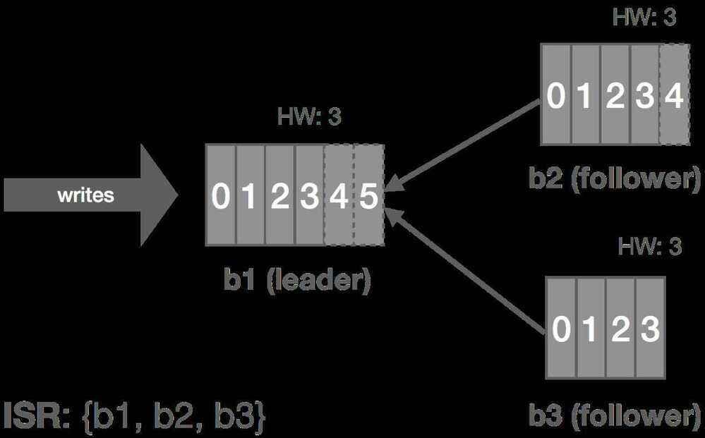
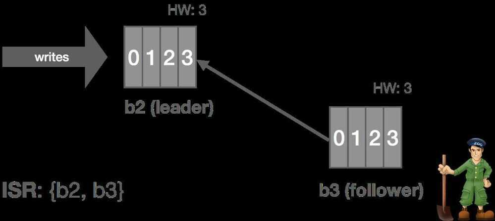
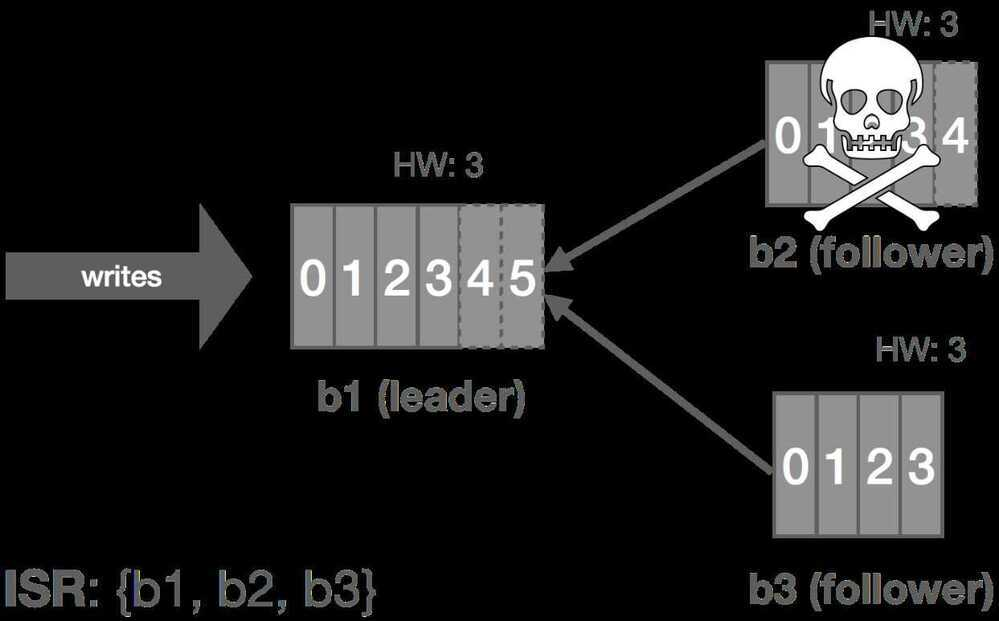
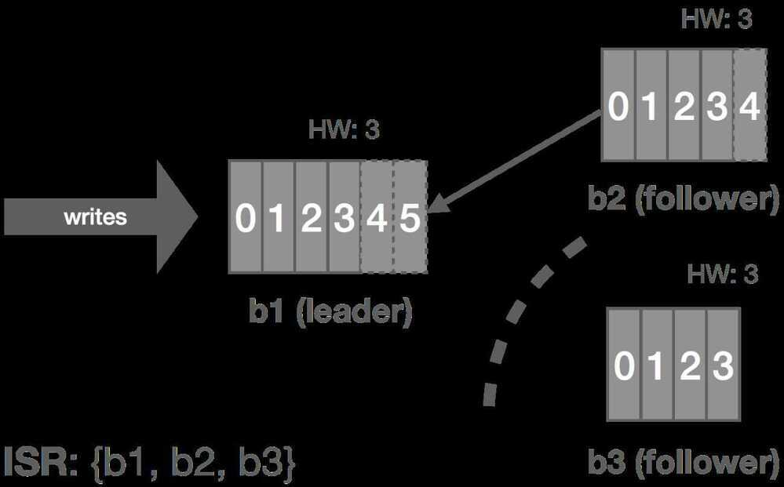
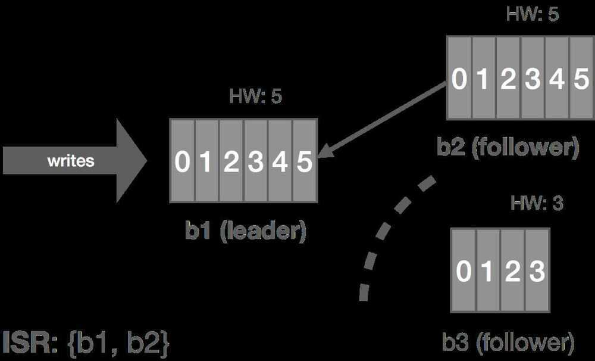

# Kafka Topic/Replication

## Kafka Topics

More partitions in a Kafka cluster leads to higher throughput. However, one does have to be aware of the potential impact of having too many partitions in total or per broker on things like availability and latency.

- More Partitions Lead to Higher Throughput
- More Partitions Requires More Open File Handles
- More Partitions May Increase Unavailability
- More Partitions May Increase End-to-end Latency
- More Partitions May Require More Memory In the Client

## How to partition your events: Same event key to same partition

Keys are used to determine the partition within a log to which a message get's appended to. While the value is the actual payload of the message

The primary goal of partitioning is the *ordering* of events: producers should send "related" events to the same partition because Kafka guarantees the ordering of events only within a given partition of a topic - not across partitions of the same topic.

My tip: if in doubt, use 30 partitions per topic. This is a good number because

1. it is high enough to cover some really high-throughput requirements
2. it is low enough that you will not hit the limit anytime soon of how many partitions a single broker can handle, even if you create many topics in your Kafka cluster
3. it is a highly composite number as it is evenly divisible by 1, 2, 3, 5, 6, 10, 15, and 30. This benefits the processing layer because it results in a more even workload distribution across application instances when horizontally scaling out (adding app instances) and scaling in (removing instances). Since [Kafka supports hundreds of thousands of partitions](https://www.confluent.io/blog/apache-kafka-supports-200k-partitions-per-cluster) in a cluster, this over-partitioning strategy is a safe approach for most users.

https://www.confluent.io/blog/how-choose-number-topics-partitions-kafka-cluster

## Kafka Replication

Once a leader is established, it needs to replicate the data to followers. In general, this can be done by either waiting for all replicas or waiting for only a quorum (majority) of replicas. There are pros and cons to both approaches.

|                 | **Pros**                               | **Cons**                                |
|------------|------------------------------|------------------------------|
| **All Replicas** | Tolerates f failures with f+1 replicas | Latency pegged to slowest replica       |
| **Quorum**       | Hides delay from a slow replica        | Tolerates f failures with 2f+1 replicas |

Waiting on all replicas means we can make progress as long as at least one replica is available. With quorum, tolerating the same amount of failures requires more replicas because we need a majority to make progress. The trade-off is that the quorum hides any delays from a slow replica. Kafka is an example of a system which uses all replicas (with some conditions on this which we will see later), and NATS Streaming is one that uses a quorum. Let's take a look at both in more detail.

## Replication in Kafka

In Kafka, a leader is selected (we'll touch on this in a moment). This leader maintains an in-sync replica set (ISR) consisting of all the replicas which are fully caught up with the leader. This is every replica, by definition, at the beginning. All reads and writes go through the leader. The leader writes messages to a write-ahead log (WAL). Messages written to the WAL are considered uncommitted or "dirty" initially. The leader only commits a message once all replicas in the ISR have written it to their own WAL. The leader also maintains a high-water mark (HW) which is the last committed message in the WAL. This gets piggybacked on the replica fetch responses from which replicas periodically checkpoint to disk for recovery purposes. The piggybacked HW then allows replicas to know when to commit.

Only committed messages are exposed to consumers. However, producers can configure how they want to receive acknowledgements on writes. It can wait until the message is committed on the leader (and thus replicated to the ISR), wait for the message to only be written (but not committed) to the leader's WAL, or not wait at all. This all depends on what trade-offs the producer wants to make between latency and durability.

The graphic below shows how this replication process works for a cluster of three brokers:b1, b2, and b3. Followers are effectively special consumers of the leader's log.

Now let's look at a few failure modes and how Kafka handles them.

## Leader Fails

Kafka relies on [Apache ZooKeeper](https://zookeeper.apache.org/) for certain cluster coordination tasks, such as leader election, though this is not actually how the log leader is elected. A Kafka cluster has a single controller broker whose election is handled by ZooKeeper. This controller is responsible for performing administrative tasks on the cluster. One of these tasks is selecting a new log leader (actuallypartitionleader, but this will be described later in the series) from the ISR when the current leader dies. ZooKeeper is also used to detect these broker failures and signal them to the controller.

Thus, when the leader crashes, the cluster controller is notified by ZooKeeper and it selects a new leader from the ISR and announces this to the followers. This gives us automatic failover of the leader.All committed messages up to the HW are preserved and uncommitted messages may be lost during the failover. In this case,b1fails andb2steps up as leader.

## Follower Fails

The leader tracks information on how "caught up" each replica is. Before Kafka 0.9, this included both how many messages a replica was behind, `replica.lag.max.messages`, and the amount of time since the replica last fetched messages from the leader, `replica.lag.time.max.ms`. Since 0.9, `replica.lag.max.messages` was removed and `replica.lag.time.max.ms` now refers to both the time since the last fetch request and the amount of time since the replica last caught up.

Thus, when a follower fails (or stops fetching messages for whatever reason), the leader will detect this based onreplica.lag.time.max.ms. After that time expires, the leader will consider the replica out of sync and remove it from the ISR. In this scenario, the cluster enters an "under-replicated" state since the ISR has shrunk. Specifically,b2fails and is removed from the ISR.

## Follower Temporarily Partitioned

The case of a follower being temporarily partitioned, e.g. due to a transient network failure, is handled in a similar fashion to the follower itself failing. These two failure modes can really be combined since the latter is just the former with an arbitrarily long partition, i.e. it's the difference between crash-stop and crash-recovery models.

In this case, b3 is partitioned from the leader. As before, `replica.lag.time.max.ms` acts as our failure detector and causes b3 to be removed from the ISR. We enter an under-replicated state and the remaining two brokers continue committing messages 4 and 5. Accordingly, the HW is updated to 5 on these brokers.

When the partition heals, b3 continues reading from the leader and catching up. Once it is fully caught up with the leader, it's added back into the ISR and the cluster resumes its fully replicated state.

We can generalize this to the crash-recovery model. For example, instead of a network partition, the follower could crash and be restarted later. When the failed replica is restarted, it recovers the HW from disk and truncates its log up to the HW. This preserves the invariant that messages after the HW are not guaranteed to be committed. At this point, it can begin catching up from the leader and will end up with a log consistent with the leader's once fully caught up.

https://bravenewgeek.com/building-a-distributed-log-from-scratch-part-2-data-replication

## Links

[Apache Kafka replication factor – What's the perfect number? - CloudKarafka, Apache Kafka Message streaming as a Service](https://www.cloudkarafka.com/blog/apache-kafka-replication-factor-perfect-number.html)

[Kafka Replication | Confluent Documentation](https://docs.confluent.io/kafka/design/replication.html)

[Kafka Topics Choosing the Replication Factor and Partitions Count](https://www.conduktor.io/kafka/kafka-topics-choosing-the-replication-factor-and-partitions-count/)
