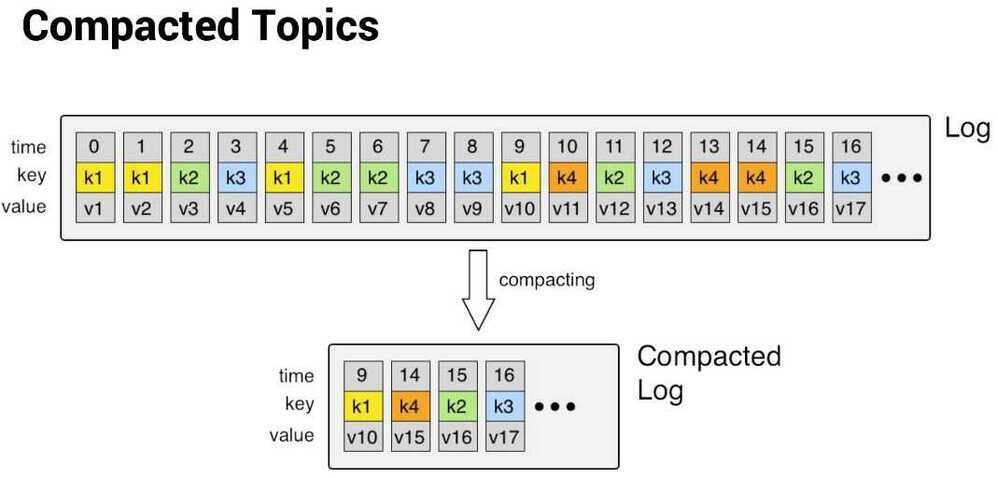

# Log Compaction

Log compaction is a mechanism to give finer-grained per-record retention, rather than the coarser-grained time-based retention. The idea is to selectively remove records where we have a more recent update with the same primary key. This way the log is guaranteed to have at least the last state for each key.

## Topic compaction

Topic compaction is a mechanism that allows you to retain the latest value for each message key in a topic, while discarding older values. It guarantees that the latest value for each message key is always retained within the log of data contained in that topic, making it ideal for use cases such as restoring state after system failure or reloading caches after application restarts. Continue reading to learn about log compaction and retention in more detail and to understand how they work to preserve the accuracy of data streams.

Log compaction is a mechanism to provide finer-grained per-record retention instead of coarser-grained time-based retention. Records with the same primary key are selectively removed when there is a more recent update. This way the log is guaranteed to have at least the last state for each key.

This retention policy can be set per-topic, so a single cluster can have some topics where retention is enforced by size or time and other topics where retention is enforced by compaction.

## Important

Compacted topics must have records with keys in order to implement record retention.

Compaction in Kafka does not guarantee there is only one record with the same key at any one time. There may be multiple records with the same key, including the tombstone, because compaction timing is non-deterministic. Compaction is only done when the topic partition satisfies a few certain conditions, such as dirty ratio, or records in inactive segment files, etc.

## Compaction enables deletes

Compaction also enables deletes. A message with a key and a null payload (note that a string value of null is not sufficient) will be treated as a delete from the log. These null payload messages are also called tombstones. Similar to when a new message with the same key arrives, this delete marker results in the deletion of the previous message with the same key. However, delete markers (tombstones) are special in that they are also cleaned out of the log after a period of time to free up space. This point is time is marked as the **Delete Retention Point** in the previous image, and is configured with `delete.retention.ms` on a topic.

### When Compaction is triggered

A topic partition is compacted if one of the following is true:

1. dirty / total › min.cleanable.dirty.ratio and message timestamp >= current time - min.compaction.lag.ms
2. message timestamp ‹ current time - max.compaction.lag.ms

## Compaction guarantees

Log compaction guarantees the following:

1. Any consumer that stays caught-up to the head of the log will see every message that is written; these messages will have sequential offsets. The topic’s `min-compaction-lag-ms` can be used to guarantee the minimum length of time must pass after a message is written before it could be compacted. That is, it provides a lower bound on how long each message will remain in the (uncompacted) head. The topic’s `max-compaction-lag-ms` can be used to guarantee the maximum delay between the time a message is written and the time the message becomes eligible for compaction.
2. Ordering of messages is always maintained. Compaction will never reorder messages, just remove some.
3. The offset for a message never changes. It is the permanent identifier for a position in the log.
4. Any consumer progressing from the start of the log will see at least the final state of all records in the order they were written. Additionally, all delete markers for deleted records will be seen, provided the consumer reaches the head of the log in a time period less than the topic’s `delete.retention.ms` setting (the default is 24 hours). In other words: since the removal of delete markers happens concurrently with reads, it is possible for a consumer to miss delete markers if it lags by more than `delete.retention.ms`.

## Use Cases

1. **Database change subscriptions.** You may have a data set in multiple data systems and often one of these systems is a database. For example you might have the cache, search cluster, and Hadoop. If you are handling the real-time updates you only need the recent log, but if you want to be able to reload the cache or restore a failed search node you may need a complete data set.
2. **Event sourcing.** While not enabled by compaction, compaction does ensure you always know the latest state of each key, which is important for event sourcing.
3. **Journaling for high-availability.** A process that does local computation can be made fault-tolerant by logging out changes that it makes to its local state so another process can reload these changes and carry on if it should fail. A concrete example of this is handling counts, aggregations, and other “group by”-like processing in a stream processing system. Kafka Streams uses this feature for this purpose.

## Links

- [Log Compacted Topics in Apache Kafka \| by Seyed Morteza Mousavi \| TDS Archive \| Medium](https://medium.com/data-science/log-compacted-topics-in-apache-kafka-b1aa1e4665a7)
- [Kafka Log Compaction \| Confluent Documentation](https://docs.confluent.io/kafka/design/log_compaction.html)
- [Apache Kafka® Topic Compaction - YouTube](https://www.youtube.com/watch?v=VAkhYxu1qII)
