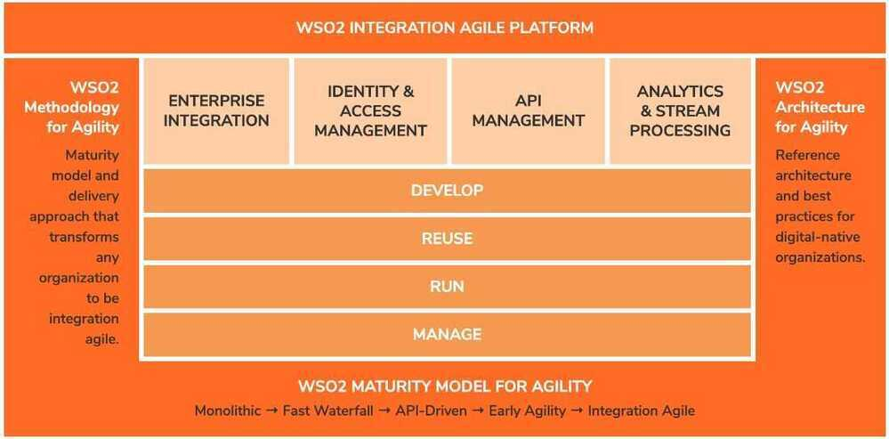
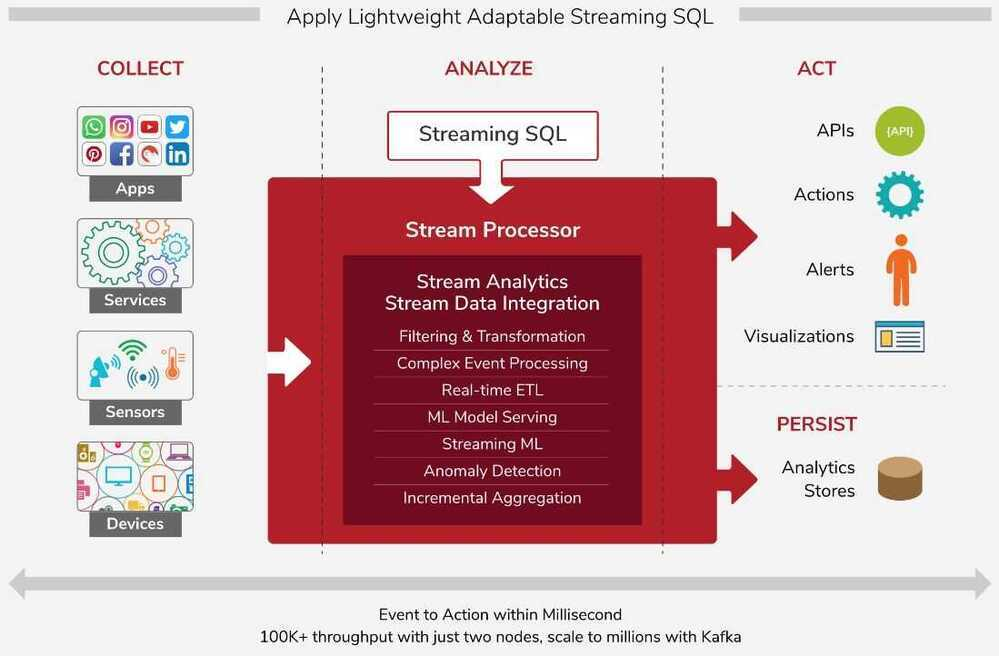

# Other Technologies

## Opensource Free Stuff

<https://free-for.dev>

## Knowledge Graph

The **Knowledge Graph** is a knowledge base used by [Google](https://en.wikipedia.org/wiki/Google) and its services to enhance its [search engine](https://en.wikipedia.org/wiki/Google_Search)'s results with information gathered from a variety of sources. This information is presented to users in a box to the right of search results. Knowledge Graph boxes were added to Google's search engine in May 2012, starting in the United States, with international expansion by the end of the year. The Knowledge Graph was powered in part by [Freebase](https://en.wikipedia.org/wiki/Freebase). The information covered by the Knowledge Graph grew significantly after launch, tripling its original size within seven months, and being able to answer "roughly one-third" of the 100 billion monthly searches Google processed in May 2016. The information is often used as a spoken answer in [Google Assistant](https://en.wikipedia.org/wiki/Google_Assistant) and [Google Home](https://en.wikipedia.org/wiki/Google_Home) searches. The Knowledge Graph has been criticized for providing answers without source attribution.

## Yocto Project

TheYocto Projectis a [Linux Foundation](https://en.wikipedia.org/wiki/Linux_Foundation) Collaborative [open source](https://en.wikipedia.org/wiki/Open_source) Project whose goal is to produce tools and processes that enable the creation of [Linux distributions](https://en.wikipedia.org/wiki/Linux_distribution) for [embedded software](https://en.wikipedia.org/wiki/Embedded_software) that are independent of the underlying architecture of the embedded hardware. The project was announced by the Linux Foundation in 2010 and launched in March, 2011, in collaboration with 22 organizations, including [OpenEmbedded](https://en.wikipedia.org/wiki/OpenEmbedded).

The Yocto Project's focus is on improving the software development process for [embedded Linux](https://en.wikipedia.org/wiki/Embedded_Linux) distributions. The Yocto Project provides interoperable tools, metadata, and processes that enable the rapid, repeatable development of Linux-based [embedded systems](https://en.wikipedia.org/wiki/Embedded_systems) in which every aspect of the development process can be customized.

## Text Analysis Tool .NET

TextAnalysis Tool .NET is a free program designed to excel at viewing, searching, and navigating large files quickly and efficiently. TextAnalysisTool.NET provides a view of the data that you can easily manipulate (through the use of various filters) to display exactly the information you need - as you need it!

The Problem: For those times when you have to analyze a large amount of textual data, picking out the relevant line(s) of interest can be quite difficult. Standard text editors usually provide a generic "find" function, but the limitations of that simple approach quickly become apparent (e.g., when it is necessary to compare two or more widely separated lines). Some more sophisticated editors do better by allowing you to "bookmark" lines of interest; this can be a big help, but is often not enough

The Solution: TextAnalysisTool.NET - a program designed from the start to excel at viewing, searching, and navigating large files quickly and efficiently. TextAnalysisTool.NET provides a view of the file that you can easily manipulate (through the use of various filters) to display exactly the information you need - as you need it

Filters: Before displaying the lines of a file, TextAnalysisTool.NET passes the lines of that file through a set of user-defined filters, dimming or hiding all lines that do not satisfy any of the filters. Filters can select only the lines that contain a sub-string, those that have been marked with a particular marker type, or those that match a regular expression. Text and background colors can be associated with each filter so that lines matching a particular filter stand out and lines matching different filters can be easily distinguished. In addition to the normal "including" filters that isolate lines of text you DO want to see, there are also "excluding" filters that can be used to suppress lines you do NOT want to see. Excluding filters are configured just like including filters but are processed afterward and remove all matching lines from the set. Excluding filters allow you to easily refine your search even further

Markers: Markers are another way that TextAnalysisTool.NET makes it easy to navigate a file; you can mark any line with one or more of eight different marker types. Once lines have been marked, you can quickly navigate between similarly marked lines - or add a "marked by" filter to view only those lines

Find: TextAnalysisTool.NET also provides a flexible "find" function that allows you to search for text anywhere within a file. This text can be a literal string or a regular expression, so it's easy to find a specific line. If you decide to turn a find string into a filter, the history feature of both dialogs makes it easy

Summary: TextAnalysisTool.NET was written with speed and ease of use in mind throughout. It saves you time by allowing you to save and load filter sets; it lets you import text by opening a file, dragging-and-dropping a file or text from another application, or by pasting text from the clipboard; and it allow

<https://textanalysistool.github.io>

<https://github.com/textanalysistool>

## GraalVM

GraalVM is a universal virtual machine for running applications written in JavaScript, Python, Ruby, R, JVM-based languages like Java, Scala, Groovy, Kotlin, Clojure, and LLVM-based languages such as C and C++.

GraalVM removes the isolation between programming languages and enables interoperability in a shared runtime. It can run either standalone or in the context of OpenJDK, Node.js or Oracle Database.

<https://www.graalvm.org>

## Amazon Mechanical Turk

Amazon Mechanical Turk(MTurk) is a [crowdsourcing](https://en.wikipedia.org/wiki/Crowdsourcing) website for businesses (known as Requesters) to hire remotely located "crowdworkers" to perform discrete on-demand tasks that computers are currently unable to do. It is operated under [Amazon Web Services](https://en.wikipedia.org/wiki/Amazon_Web_Services), and is owned by [Amazon](https://en.wikipedia.org/wiki/Amazon.com).Employers post jobs known asHuman Intelligence Tasks(HITs), such as identifying specific content in an image or video, writing product descriptions, or answering questions, among others. Workers, colloquially known asTurkersorcrowdworkers, browse among existing jobs and complete them in exchange for a rate set by the employer. To place jobs, the requesting programs use an open [application programming interface](https://en.wikipedia.org/wiki/Application_programming_interface)(API), or the more limited MTurk Requester site.As of April 2019, Requesters could register from only 49 approved countries.

<https://en.wikipedia.org/wiki/Amazon_Mechanical_Turk>

## WSO2 Integration Agile Platform

The WSO2 Integration Agile Platform is a broad framework to develop, reuse, run and manage integrations. It's architected around a common code base of fully open source integration technologies. Components can be used individually, or as a cohesive integration-agile platform.

## WSO2 Stream Processor

WSO2 Stream Processor is an open source, cloud native and lightweight stream processing platform that understands streaming SQL queries in order to capture, analyze, process and act on events in real time. This facilitates real-time streaming data integration and analytics. With the product's powerful streaming SQL, simple deployment, and ability to adapt to changes rapidly, enterprises can go to market faster and achieve greater ROI. Unlike other offerings, it provides a simple two-node deployment for high availability and scales beyond with its distributed deployment to cater to extremely high workloads.

## WSO2 API Manager

WSO2 API Manager is an open source enterprise-class solution that supports API publishing, lifecycle management, application development, access control, rate limiting and analytics in one cleanly integrated system.

## WSO2 Identity Server

WSO2 Identity Server is API-driven, is based on open standards with the deployment options of on-premise, cloud or hybrid. It supports complex IAM requirements given its high extensibility.

WSO2 Identity Server helps you do single sign-on and identity federation backed by strong and adaptive authentication, securely expose APIs, and manage identities by connecting to heterogeneous user stores.

Leverage the power of open-source IAM in your enterprise to innovate fast and build secure Customer IAM (CIAM) solutions to provide an experience your users will love.

<https://wso2.com>

## Hypertrack

HyperTrack is live [location](https://en.wikipedia.org/wiki/Location_(geography)) platform in the cloud offering [developer](https://en.wikipedia.org/wiki/Software_developer) tools for mobile application developers in companies of all sizes worldwide. Its toolset contains [iOS](https://en.wikipedia.org/wiki/IOS), and [Android](https://en.wikipedia.org/wiki/Android_(operating_system))[SDKs](https://en.wikipedia.org/wiki/Software_development_kit) which generate live location data, that is then consumed through webhooks, APIs or visual experiences on the web, iOS and Android. Developers have used HyperTrack to build applications like sales-force automation, service fleet efficiency, vehicle asset tracking, delivery tracking, gig economy, live location sharing, automated mileage tracking and expensing

<https://www.hypertrack.com>

<https://github.com/hypertrack>

## Predictive Dialer

Apredictive dialerdials a list of [telephone numbers](https://en.wikipedia.org/wiki/Telephone_number) and connects answered dials to people making calls, often referred to as agents. Predictive dialers use statistical [algorithms](https://en.wikipedia.org/wiki/Algorithm) to minimize the time that agents spend waiting between conversations, while minimizing the occurrence of someone answering when no agent is available.

When dialing numbers one at a time, there are two sources of delay. First, only some fraction of dials are answered; for example, if 1 out of 3 dials are answered, a predictive dialer might dial 3 lines every time an agent becomes available. Second, even dials that are answered take some time before being picked up. If it typically takes 10 seconds for someone to pick up, and conversations typically last 90 seconds, a predictive dialer might start dialing at 80 seconds.A predictive dialer does so by discarding all tones and only passing "Hellos" from the lead to the agent.

Dialing one number at a time, only when an agent is available, typically keeps agents utilized for 40 minutes per hour (33% idle time). Predictive dialing can increase utilization to 57 minutes per hour (5% idle time).

Predictive dialers may be standalone hardware devices, cloud-based, or they may be integrated in software with call center or contact center platforms. A cloud-based predictive dialer provides the functionalities of a traditional predictive dialer without requiring installation on the local device and reduces the dependency on the hardware.The dialer can often also perform less aggressive dialing modes such as, power, progressive, or preview dialing.

<https://en.wikipedia.org/wiki/Predictive_dialer>

## VOIP

Asterisk is a free and open source framework for building communications applications.

<https://www.asterisk.org>

## Watchman

Watchman exists to watch files and record when they change. It can also trigger actions (such as rebuilding assets) when matching files change.

<https://facebook.github.io/watchman>

## Retool

Build internal tools, remarkably fast

Stop wrestling with UI libraries, hacking together data sources, and figuring out access controls. Start shipping apps that move your business forward.

<https://retool.com>

<https://www.freecodecamp.org/news/build-a-crm>

## Others

- Party town - offload js scripts to workers
- Super tokens - open source authentication and authorisation SDK library
- Millisearch, zinc search engine
- Trpc
- Danfo.js - pandas in js
- Mantin.js
- Amplication
