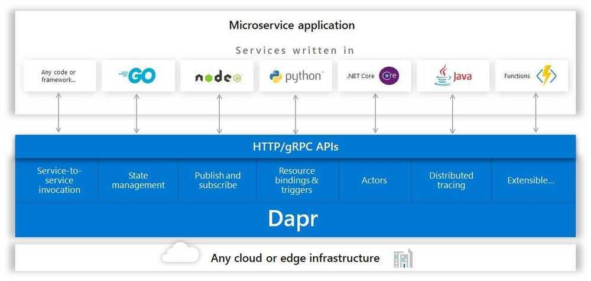

# Others - Distributed Systems

## Orbit

Orbit - Virtual actor framework for building distributed systems

Orbit is a framework to write distributed systems using virtual actors on the JVM. It allows developers to write highly distributed and scalable applications while greatly simplifying clustering, discovery, networking, state management, actor lifetime and more.

https://github.com/orbit/orbit

## Netflix Eureka

AWS Service registry for resilient mid-tier load balancing and failover.

https://github.com/Netflix/eureka

## Netflix Ribbon

Ribbon is a Inter Process Communication (remote procedure calls) library with built in software load balancers. The primary usage model involves REST calls with various serialization scheme support.

https://github.com/Netflix/ribbon

## Neflix Hysterix

Hystrix is a latency and fault tolerance library designed to isolate points of access to remote systems, services and 3rd party libraries, stop cascading failure and enable resilience in complex distributed systems where failure is inevitable.

https://github.com/Netflix/Hystrix

## Hydra

A framework for elegantly configuring complex applications.

https://github.com/facebookresearch/hydra

[https://cli.dev](https://cli.dev/)

## dapr

Dapr is a portable, serverless, event-driven runtime that makes it easy for developers to build resilient, stateless and stateful microservices that run on the cloud and edge and embraces the diversity of languages and developer frameworks.

Dapr codifies thebest practicesfor building microservice applications into open, independent, building blocks that enable you to build portable applications with the language and framework of your choice. Each building block is independent and you can use one, some, or all of them in your application.

https://github.com/dapr/dapr
