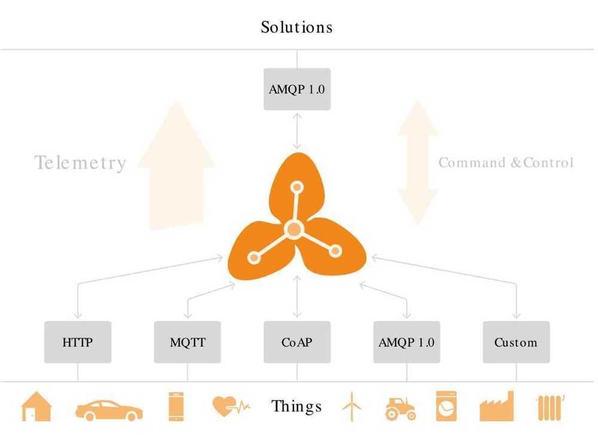

# Others - IoT

## MainFlux

Mainflux is highly secure, scalable, open-source IoT platform written in Go and deployed in Docker.

It serves as software infrastructure and set of microservices for development of the

Internet of Things Solutions and deployment of Intelligent products.

## ThingsBoard

- Open source
- Device management, data collection, processing and visualization for IoT

## Eclipse Hono

Eclipse Hono provides remote service interfaces for connecting large numbers of IoT devices to a back end and interacting with them in a uniform way regardless of the device communication protocol.

Hono specifically supports scalable and secure ingestion of large volumes of sensor data by means of its Telemetry and Event APIs. Hono's Command & Control API allows for sending commands (request messages) to devices and receive a reply to such a command from a device in an asynchronous way.

### Pros

- Open Source
- Broker which supports multiple protocols (provided use a motivation to do the same easily)
- Separates device components as following (on which business application interacts)

  - Authentication
  - Registry
  - Messaging Network

### Cons

- Is at a nascent stage
- Could not find a success story of IoT at scale deployment (10x bigger than us in data point / sec)
- Highly opinionated and will clash with multiple services already present in house while providing minimal value in return

## MQTT Adapter

The MQTT protocol adapter exposes an MQTT topic hierarchy for publishing telemetry data and events to downstream consumers and for receiving commands from applications and sending back responses.

<https://github.com/eclipse/hono>

<http://www.eclipse.org/hono>

<https://blog.bosch-si.com/developer/eclipse-hono-connecting-large-numbers-of-iot-devices>

## Flogo

Project Flogo is an ultra-light, Go-based open source ecosystem for building event-driven apps.

The notion of triggers and actions are leveraged to process incoming events. An action, a common interface, exposes key capabilities such as application integration, stream processing, etc

- **App = Trigger(s) + Actions [&Activities]**
- **Triggers**
  - receive data from external sources
  - are managed by a configurable threading model
  - have a common interface enabling anyone to build a Flogo trigger
- **Handlers**
  - dispatch events to actions
- **Actions**
  - process events in a manner suitable with the implementation
  - have a common interface enabling opinionated event processing capabilities

<https://github.com/tibcosoftware/flogo>

<https://www.flogo.io>

## Node-RED

Flow-based programming for the Internet of Things

Node-RED is a programming tool for wiring together hardware devices, APIs and online services in new and interesting ways.

It provides a browser-based editor that makes it easy to wire together flows using the wide range of nodes in the palette that can be deployed to its runtime in a single-click.

See Also - <https://thingsboard.io>

## Eclipse Ditto

- For digital twins

<https://www.eclipse.org/ditto>

<https://projects.eclipse.org/proposals/eclipse-ditto>

## Digital Twins - Bosch IoT - not free (free till some limit)

<https://www.bosch-iot-suite.com/things>

## Silo

Silo is an open source tool to archive MQTT messages. It supports MySQL, Postgres and Mongodb. Silo is compatible with emqtt and verneMQ.

<https://github.com/mtsoleimani/Silo>

## Hawkbit

Eclipse [hawkBit](http://www.eclipse.org/hawkbit/index.html) is an domain independent back end solution for rolling out software updates to constrained edge devices as well as more powerful controllers and gateways connected to IP based networking infrastructure.

hawkBit is device and communication channel neutral by means of supporting

- SoftwareandOperating systemupdates forM2M gateways(typically but not necessarily running Linux)and
- Firmwareupdates forembeddeddevices

both for

- cableor
- over the air(OTA) connected devices

Features at a glance

- A device and software repository.
- Artifact content delivery.
- Software update and roll out management.
- Reporting and monitoring.
- Interfaces:
  - for direct device control.
  - for IoT solutions or applications to manage the repository and the roll outs.
  - for device management federation (i.e. indirect device control)
  - and a user interface to operators to manage and run the roll outs.

<https://github.com/eclipse/hawkbit>
