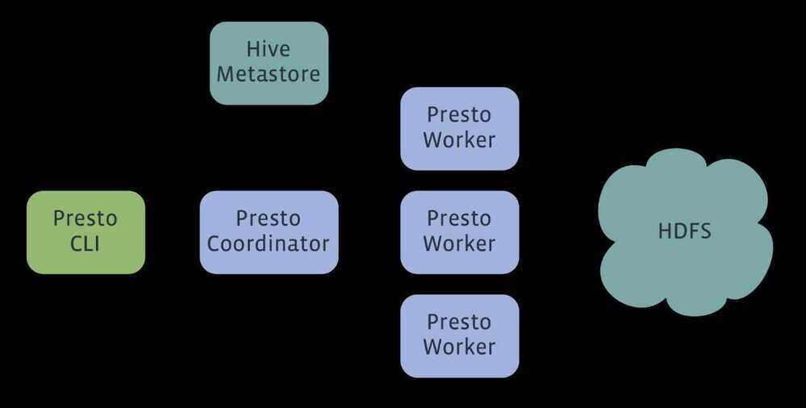

# Presto

## Distributed SQL Query Engine for BigData

Presto is an open source distributed SQL query engine for running interactive analytic queries against data sources of all sizes ranging from gigabytes to petabytes.

Presto is a distributed system that runs on a cluster of machines. A full installation includes a coordinator and multiple workers. Queries are submitted from a client such as the Presto CLI to the coordinator. The coordinator parses, analyzes and plans the query execution, then distributes the processing to the workers.

## What Presto Is Not

Since Presto is being called a database by many members of the community, it makes sense to begin with a definition of what Presto is not.

Do not mistake the fact that Presto understands SQL with it providing the features of a standard database. Presto is not a general-purpose relational database. It is not a replacement for databases like MySQL, PostgreSQL or Oracle. Presto was not designed to handle Online Transaction Processing (OLTP). This is also true for many other databases designed and optimized for data warehousing or analytics.

## What Presto Is

Presto is a tool designed to efficiently query vast amounts of data using distributed queries. If you work with terabytes or petabytes of data, you are likely using tools that interact with Hadoop and HDFS. Presto was designed as an alternative to tools that query HDFS using pipelines of MapReduce jobs such as Hive or Pig, but Presto is not limited to accessing HDFS. Presto can be and has been extended to operate over different kinds of data sources including traditional relational databases and other data sources such as Cassandra.

Presto was designed to handle data warehousing and analytics: data analysis, aggregating large amounts of data and producing reports. These workloads are often classified as Online Analytical Processing (OLAP).

## Concepts

### Server Types

- Coordinator
- Worker

### Data Sources

- Connector
- Catalog
- Schema
- Table

### Query Execution Model

- Statement
- Query
- Stage
- Task
- Split
- Driver
- Operator
- Exchange

https://prestodb.io/docs/current/overview/concepts.html

https://prestodb.io

https://eng.lyft.com/presto-infrastructure-at-lyft-b10adb9db01

https://prestodb.io/docs/current/index.html

https://aws.amazon.com/big-data/what-is-presto

## Trino

Distributed SQL query engine for big data, formerly known as PrestoSQL.

Trino is a distributed query engine that processes data in parallel across multiple servers. There are two types of Trino servers, [coordinators](https://trino.io/docs/current/overview/concepts.html#trino-concept-coordinator) and [workers](https://trino.io/docs/current/overview/concepts.html#trino-concept-worker).

[GitHub - trinodb/trino: Official repository of Trino, the distributed SQL query engine for big data, formerly known as PrestoSQL (https://trino.io)](https://github.com/trinodb/trino)

[Trino concepts - Trino 435 Documentation](https://trino.io/docs/current/overview/concepts.html)

### Difference between Trino and Presto

Trino is the superior query engine. Since the two projects were forked, Trino’s development has been going at roughly thrice the pace of Presto’s, and it shows. It runs faster and serves a much wider variety of use cases. If your existing tech stack heavily relies on Spark and [Hive](https://www.starburst.io/learn/data-fundamentals/hive/) for all things data, it may make sense to use Presto. For all other situations, Trino is the better, more versatile, more powerful option.

A few sprinkles on top: if you are using Hive, Trino has a [built-in procedure to migrate your Hive tables to Apache Iceberg](https://trino.io/docs/current/connector/iceberg.html#migrate-table), allowing you to easily modernize your data stack and reap the performance and cost benefits. Some users who’ve already gone through with migrating have [seen certain queries execute 95% faster](https://trino.io/blog/2022/12/09/trino-summit-2022-shopify-recap.html).

[What’s the Difference Between Trino and PrestoDB? - Pandio](https://pandio.com/difference-between-trino-and-prestodb/)
