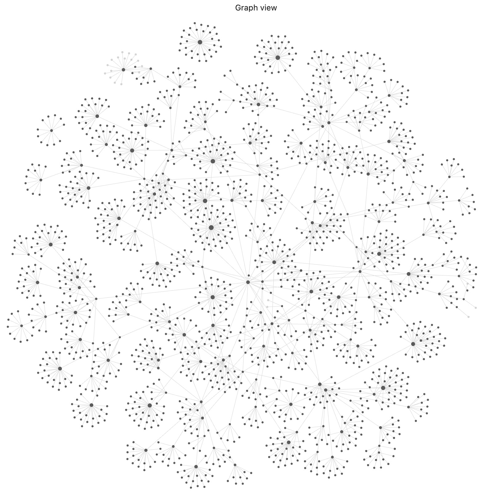
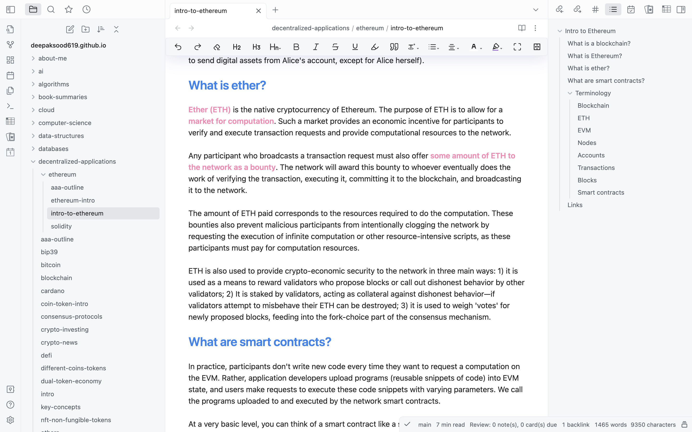

# Deep Notes

Deployed at - [https://deepaksood619.github.io/](https://deepaksood619.github.io/)

This is my personal wiki where I share everything I know about this world in form of an online wiki.

The purpose of this site is to force me to improve the quality of these notes, the prospect of being read by someone being motivating. It also allows me to access it everywhere.

If this is your first time visiting this wiki, take a look at [outline](https://deepaksood619.github.io/#outline)

**Why I write (summed up in one quote) -** Your brain is for having ideas not holding them.

## Size of Wiki

Below are my 1900+ notes & their relations visualized.




This wiki is large. 130,000+ lines of markdown (calculated with [loc](https://github.com/cgag/loc))

```bash
loc

--------------------------------------------------------------------------------
 Language             Files        Lines        Blank      Comment         Code
--------------------------------------------------------------------------------
 Markdown              2008       198771        67986            0       130785
 JSON                     3        14516            0            0        14516
 JavaScript               3          203           18           66          119
 CSS                      1           30            2            7           21
 YAML                     1           44            4           20           20
 Plain Text               1            2            0            0            2
--------------------------------------------------------------------------------
 Total                 2017       213566        68010           93       145463
--------------------------------------------------------------------------------
```

## Outline

- About me
- Computer Science
  - AI
  - Algorithms
  - Data Structures
  - Languages
    - Python
  - Networking
  - Databases
  - Frontend
  - DevOps
  - Cloud - AWS
  - Cloud Others
  - Technologies
  - Decentralized Applications / Cryptocurrencies
- Book Summaries
- Mathematics
- Knowledge
  - Economics
  - Management
  - Psychology

## Getting started

This garden is quite literally my digital brain. It includes my thoughts, notes and links on topics I care about.

I update the notes daily in my [github repo](https://github.com/deepaksood619/deepaksood619.github.io/), and build it few times in a month using Github Actions and Docusaurus.

The content being markdown files, which after every commit to the builds the website using docusaurus and publishes it to [deepaksood619.github.io](https://deepaksood619.github.io/) from which you are likely reading this page.

The way I structure each page often looks the same and follows a structure. The sidebar you see on the left is sorted alphabetically. It's nested too. Many top level folders are nested quite deep.

I use Zettlekasten Method for note taking and obsidian tool to manage and structure my notes. I have previously used Onenote but grown out of it in about 4 years, since it doesn't scale in terms of number of notes and doesn't have linking of notes

**My Obsidian View**



## Must Read Pages

There's 2000+ pages in here and lots of them I think are interesting. But these few can be nice starts for a read:
d

- [Quotes](https://deepaksood619.github.io/knowledge/quotes-proverbs/) small phrases that makes my day and help me to remember and revise simple rules in a fun way
- [Mental Models](https://deepaksood619.github.io/knowledge/general/mental-models) that I have compiled over the years and helps me learn concepts quickly of any domain and connect concepts across domains
- [Learning how to learn](https://deepaksood619.github.io/psychology/learning/learning-intro) course that changed my learning approach and in turn my whole life, and the reason why I write and maintain these notes.
- [Book - Principles by Ray Dalio](https://deepaksood619.github.io/book-summaries/principles)
- [Fallacies of Distributed Computing](https://deepaksood619.github.io/computer-science/distributed-system/fallacies-and-problems) and [Biases / Fallacies](https://deepaksood619.github.io/psychology/biases-fallacies) of Human Computing, which everyone should know and try to overcome in their lifetimes
- [Types of Databases](https://deepaksood619.github.io/databases/concepts/types-of-databases) to organize your data in the right database, since data has gravity, it becomes harder with quantity of data to migrate data over time to other databases
- [My Experiences](https://deepaksood619.github.io/about-me/experience) over the years and [Social links](https://deepaksood619.github.io/about-me/social-links) to connect with me

## Donate

If you found this helpful, please consider making a donation to support my work.

Eth: Ethereum MainNet - 0xC629700c063c9848c2D09e79248d39b997fAD48E

BTC - bc1qfpm3x5qcr6su8ndq8afmw6u5hzdwpyauwkdcdf

DFI: DFI Chain - df1qtzjm8z8vp05klug8jvhyjnjpg48jqevel9v43r

Paypal - [deepaksood619](https://paypal.me/deepaksood619?country.x=IN&locale.x=en_GB)

## Contact

[Deepak Sood | LinkedIn](https://www.linkedin.com/in/deepaksood619/)
